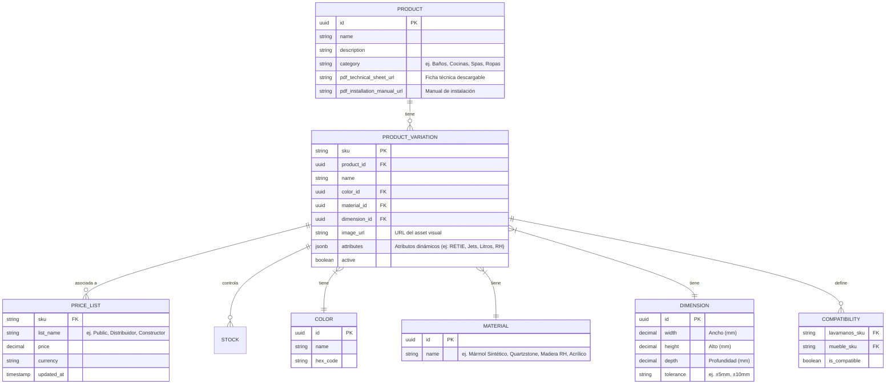

# Especificación: Arquitectura de Datos e Integración SAP

Esta página describe la arquitectura de datos, gestión de catálogos masivos de SKUs (variaciones y precios) y la sincronización con el Service Layer de SAP.

---

## 1. Modelo de Datos y Soporte de SKUs (Supabase)

Para soportar miles de SKUs con múltiples variaciones sin comprometer el rendimiento, se propone una estructura de base de datos relacional y flexible en **Supabase** (PostgreSQL):

### Entidades Clave

*   **Esquema Multivariante con Atributos Flexibles (JSONB):** Para evitar cientos de columnas nulas debido a la diferencia entre categorías (ej: un Spa requiere voltaje, certificación RETIE y cantidad de jets, mientras que un mueble requiere tipo de riel o cajones), se introduce el campo `attributes` (`jsonb`) en `PRODUCT_VARIATION`. Esto permite realizar búsquedas y filtrados dinámicos mediante índices GIN en Supabase.
*   **Gestión de Descargables de Producto:** Se incorporan los campos `pdf_technical_sheet_url` y `pdf_installation_manual_url` en la entidad base `PRODUCT` para suplir la necesidad de proveer fichas técnicas en formato PDF directamente en la interfaz.
*   **Atributos Estructurales e Tolerancias:** Los materiales y dimensiones se extraen a tablas maestras (`MATERIAL`, `DIMENSION`) para controlar el visualizador "Mix & Match" de forma estricta, incluyendo la tolerancia física de fabricación (clave en mármol sintético y jacuzzis de resina).
*   **Compatibilidades:** La tabla `Compatibility` define las combinaciones exactas de calce físico permitidas entre lavamanos y muebles base.

---

## 2. Gestión de Listas de Precios y Actualización Externa

Las listas de precios deben actualizarse dinámicamente desde endpoints o scripts de sincronización (SAP, Excel, etc.):

*   **API REST (Supabase):** Exposición de endpoints de actualización por lotes (upsert masivos) protegidos mediante roles específicos y RLS (Row Level Security).
*   **Manejo de Varias Listas:** Tablas dedicadas a `price_list` asociando SKU a diferentes listas comerciales según el perfil de cliente (Público, Distribuidor, etc.).

---

## 3. Integración con SAP Service Layer

La conexión con el ERP se realizará a través del **Service Layer de SAP Business One** (API basada en OData):

*   **Dirección de Sincronización:**
    *   **SAP ➔ Supabase (Programado/Eventos):** Actualización de stock de seguridad, estado de SKUs, adición de nuevos productos y listas de precios oficiales.
    *   **Supabase ➔ SAP (Tiempo Real):** Inyección de órdenes de venta creadas en el e-commerce a través del Service Layer (`/b1s/v1/Orders`).
*   **Capa Intermedia (Edge Functions):** Se usarán Supabase Edge Functions para manejar la autenticación mediante cookies (SessionID de SAP), realizar llamadas seguras y formatear los datos entre OData (SAP) y PostgreSQL (Supabase).

---

## 4. Comparativa de Stack Tecnológico: Actual vs. Propuesto

El desarrollo del nuevo e-commerce representa una transición tecnológica para resolver las limitaciones del stack actual de Firplak.com:

| Componente | Stack Actual (Firplak.com) | Stack Propuesto | Justificación y Ventaja |
| :--- | :--- | :--- | :--- |
| **CMS / Backend** | WordPress + WooCommerce | **Supabase (PostgreSQL)** + **SAP Service Layer** | Desacopla la lógica comercial y agiliza consultas complejas sobre millones de SKUs y listas de precios relacionales. |
| **Frontend** | Kadence Theme (Gutenberg/PHP) | **Next.js / React** | Mayor interactividad en tiempo real (Visualizador Mix & Match sin recargas de página) y mejor rendimiento de carga (FCP/LCP). |
| **Filtros de Catálogo** | BeRocket Ajax Filters | Filtros Nativos indexados en Supabase | Evita consultas lentas a la base de datos de WordPress (wp_postmeta) mediante índices optimizados en PostgreSQL. |
| **Pasarela de Pagos** | ePayco + Addi (WooCommerce) | API ePayco SDK + API Addi SDK | Control total de la interfaz de usuario de checkout, evitando redirecciones complejas y mejorando conversión de transacciones. |
| **Integración ERP** | Desconectado o manual | **SAP Service Layer (OData)** | Automatización de inventario, sincronización de precios y creación en tiempo real de órdenes de venta. |

