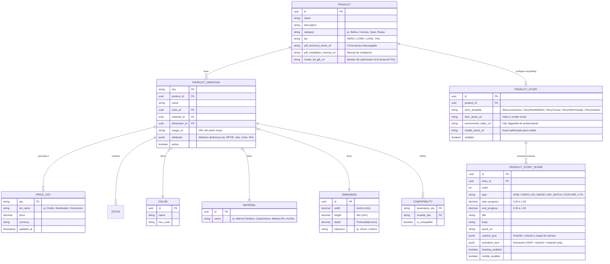

# Especificación: Arquitectura de Datos e Integración SAP

> [!IMPORTANT]
> **Estrategia Condensada del Segmento**:
> Garantizar escalabilidad horizontal y tiempos de respuesta inferiores a 100 ms para un catálogo masivo de miles de SKUs con atributos polimórficos (JSONB en Supabase). Desacopla la navegación del cliente web respecto al ERP corporativo SAP Business One, sincronizando precios, inventarios y órdenes de compra de forma asíncrona e idempotente vía SAP Service Layer.

Esta página describe la arquitectura de datos, gestión de catálogos masivos de SKUs (variaciones y precios) y la sincronización con el Service Layer de SAP.

---

## 1. Modelo de Datos y Soporte de SKUs (Supabase)

Para soportar miles de SKUs con múltiples variaciones sin comprometer el rendimiento, se propone una estructura de base de datos relacional y flexible en **Supabase** (PostgreSQL):

### Entidades Clave



*   **Motor de Storytelling Parametrizable (`PRODUCT_STORY` y `PRODUCT_STORY_SCENE`):** Para evitar programar manualmente cada PDP, el scrollytelling se desacopla en tablas de Supabase. El frontend recibe las escenas con sus rangos de progreso (`start_progress` a `end_progress`) y el motor GSAP/Three.js orquesta la cámara, los textos DOM y las transiciones automáticamente.
*   **Clasificación por Tiers (`tier`):**
    *   **`HERO` (Tier 1):** 3D real interactivo (React Three Fiber) + clips Higgsfield + GSAP avanzado + Mix & Match (lanzamientos e insignias).
    *   **`CORE` (Tier 2):** Fotografía de estudio + GSAP + parallax + color swap + Mix & Match (sin Three.js).
    *   **`LONG_TAIL` (Tier 3):** PDP convencional ultrarrápida + microanimaciones + ficha técnica.
*   **Esquema Multivariante con Atributos Flexibles (JSONB):** Para evitar cientos de columnas nulas debido a la diferencia entre categorías (ej: un Spa requiere voltaje, certificación RETIE y cantidad de jets, mientras que un mueble requiere tipo de riel o cajones), se introduce el campo `attributes` (`jsonb`) en `PRODUCT_VARIATION`. Esto permite realizar búsquedas y filtrados dinámicos mediante índices GIN en Supabase.
*   **Gestión de Descargables y 3D:** Se incorporan los campos `pdf_technical_sheet_url`, `pdf_installation_manual_url` y `model_3d_glb_url` en la entidad base `PRODUCT`.
*   **Atributos Estructurales e Tolerancias:** Los materiales y dimensiones se extraen a tablas maestras (`MATERIAL`, `DIMENSION`) para controlar el visualizador "Mix & Match" de forma estricta, incluyendo la tolerancia física de fabricación.
*   **Compatibilidades:** La tabla `Compatibility` define las combinaciones exactas de calce físico permitidas entre lavamanos y muebles base.


---

## 2. Gestión de Listas de Precios y Actualización Externa

Las listas de precios deben actualizarse dinámicamente desde endpoints o scripts de sincronización (SAP, Excel, etc.):

*   **API REST (Supabase):** Exposición de endpoints de actualización por lotes (upsert masivos) protegidos mediante roles específicos y RLS (Row Level Security).
*   **Manejo de Varias Listas:** Tablas dedicadas a `price_list` asociando SKU a diferentes listas comerciales según el perfil de cliente (Público, Distribuidor, etc.).

---

## 3. Integración con SAP Service Layer

La conexión con el ERP se realizará a través del **Service Layer de SAP Business One** (API basada en OData):

*   **Dirección de Sincronización:**
    *   **SAP ➔ Supabase (Programado/Eventos):** Actualización de stock de seguridad, estado de SKUs, adición de nuevos productos y listas de precios oficiales.
    *   **Supabase ➔ SAP (Tiempo Real):** Inyección de órdenes de venta creadas en el e-commerce a través del Service Layer (`/b1s/v1/Orders`).
*   **Capa Intermedia (Edge Functions):** Se usarán Supabase Edge Functions para manejar la autenticación mediante cookies (SessionID de SAP), realizar llamadas seguras y formatear los datos entre OData (SAP) y PostgreSQL (Supabase).

---

## 4. Arquitectura del FIRPLAK Experience Stack (Visual & Storytelling Engine)

Para convertir el catálogo estático actual en una experiencia visual cinematográfica sin disparar los costos de desarrollo ni degradar el rendimiento, se introduce una capa de experiencia sobre Next.js:

```
                  FIRPLAK EXPERIENCE STACK
                      Next.js / React
              ┌───────────────┼────────────────┐
              │               │                │
              ▼               ▼                ▼
           HTML/CSS         GSAP       React Three Fiber / Drei
        contenido SEO   ScrollTrigger         Three.js
        textos / cards  scrollytelling       producto 3D
        filtros / PDP   pin/scrub/snap     cuando aplique (Tier 1)
              │               │                │
              └───────────────┼────────────────┘
                              │
                        MEDIA ASSETS
              ┌───────────────┼────────────────┐
              ▼               ▼                ▼
        Foto producto   CAD / Blender     Higgsfield REAL
       REAL de estudio  producto REAL   cinematografía IA
              │               │                │
              └───────────────┼────────────────┘
                              │
                    Supabase (PostgreSQL)
                producto + storytelling scenes
                              │
                              ▼
                   SAP Business One (ERP)
                precio / inventario / pedido
```

### A. Pipeline de Producción de Assets 3D (CAD → Web)
1. **Fuente de Ingeniería**: CAD industrial nativo de Firplak (Autodesk Fusion 360 / SolidWorks).
2. **Retopología y Optimización en Blender**:
   - Conversión de mallas industriales pesadas a modelos *low-poly* de alta eficiencia geométrica.
   - Bakes de oclusión ambiental, curvatura y mapas de normales.
   - Materiales PBR calibrados: gelcoat sanitario, vetas de mármol sintético, cuarzo y vetas melamínicas RH.
3. **Exportación WebGL**:
   - Formato **glTF / GLB** con compresión de geometría **Draco / Meshopt** y texturas en formato **KTX2 / Basis Universal** (<2 a 3 MB total por modelo).
4. **Render Master en Blender**:
   - Escenas de estudio con cámaras fijas para generar los renders de catálogo, planos acotados, secuencias 360 y fotogramas base para el motor de IA.

### B. Rol y Regla de Oro de Cinematografía IA (Higgsfield)
Higgsfield opera como el generador de atmósfera y contexto, nunca como definidor de producto:
*   ✅ **Permitido en Higgsfield (Atmósfera y Mundo Exterior):**
    - Ambientaciones lifestyle de alta gama (baños modernos, cocinas de autor, terrazas de exterior).
    - Cinemática ambiental: luz entrando por ventanales, vapor, flujos de agua, sombras suaves y reflejos arquitectónicos.
    - Videos de campaña publicitaria y fondos cinematográficos de 3 a 6 segundos para el Hero de la Home.
*   ❌ **Prohibido en Higgsfield (Fidelidad Técnica Firplak):**
    - Nunca se utiliza para definir o generar la geometría física del producto, medidas en cm, posición o diámetro del desagüe, orificios de grifería, color comercial exacto, espesor ni compatibilidad física. Para eso se utiliza estrictamente el modelo CAD real en Three.js o fotografía de estudio.

### C. Sistema de Storytelling Parametrizable por Familia
Para escalar a cientos de SKUs sin programar landings individuales, se definen 5 templates estandarizados:
1. `StoryLavamanos`
2. `StoryMuebleBaño`
3. `StoryCocina`
4. `StoryHidromasaje`
5. `StoryOutdoor`

Cada SKU en Supabase simplemente suministra sus assets y parámetros a través de `PRODUCT_STORY` y `PRODUCT_STORY_SCENE`.

---

## 5. Comparativa de Stack Tecnológico: Actual vs. Propuesto

El desarrollo del nuevo e-commerce representa una transición tecnológica para resolver las limitaciones del stack actual de Firplak.com:

| Componente | Stack Actual (Firplak.com) | Stack Propuesto | Justificación y Ventaja |
| :--- | :--- | :--- | :--- |
| **CMS / Backend** | WordPress + WooCommerce | **Supabase (PostgreSQL)** + **SAP Service Layer** | Desacopla la lógica comercial y agiliza consultas complejas sobre millones de SKUs y listas de precios relacionales. |
| **Frontend Base** | Kadence Theme (Gutenberg/PHP) | **Next.js / React (App Router)** | Renderizado híbrido SSR/ISR para SEO y rendimiento superior de carga (FCP/LCP). |
| **Experiencia / Scrollytelling** | Sliders estáticos (Smart Slider 3) | **GSAP 3 + ScrollTrigger + Lenis** | Control preciso de timelines, fijación de pantallas (*pinning*) y scrubbing al scroll sin depender de APIs experimentales. |
| **Producto 3D (Tier 1)** | No existente (fotos planas) | **Three.js + React Three Fiber + Drei** | Inspección 3D de geometría CAD real, rotación al scroll y cambio dinámico de materiales en tiempo real. |
| **Compresión 3D** | N/A | **GLB + KTX2 + Draco / Meshopt** | Modelos 3D hiper-optimizados (<3 MB) que no saturan el ancho de banda ni la memoria móvil. |
| **Cinematografía Lifestyle** | Videos pesados estáticos | **Higgsfield REAL (Clips IA 3-6s)** | Atmósferas envolventes de arquitectura, agua y luz generadas a partir de renders exactos de producto. |
| **Filtros de Catálogo** | BeRocket Ajax Filters | Filtros Nativos indexados en Supabase | Evita consultas lentas a la base de datos de WordPress (wp_postmeta) mediante índices optimizados en PostgreSQL. |
| **Pasarela de Pagos** | ePayco + Addi (WooCommerce) | API ePayco SDK + API Addi SDK | Control total de la interfaz de usuario de checkout, evitando redirecciones complejas y mejorando conversión de transacciones. |
| **Integración ERP** | Desconectado o manual | **SAP Service Layer (OData)** | Automatización de inventario, sincronización de precios y creación en tiempo real de órdenes de venta. |

