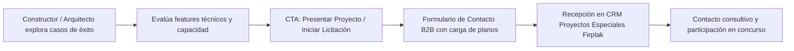

# Especificaciones de Segmento: Carpintería de Obra (Proyectos & Constructoras)

> [!IMPORTANT]
> **Estrategia Condensada del Segmento**:
> Posicionar a Firplak como el aliado estratégico de referencia para constructoras y firmas de arquitectura mediante una **galería de casos de éxito y proyectos emblemáticos**. Esta sección **no muestra precios ni se conecta transaccionalmente con SAP**; su objetivo es destacar los *features* clave de ingeniería, diseño y manufactura a escala, generando una **intención de contacto calificada** con el constructor o arquitecto para ingresar a la competencia y licitación de proyectos.

Este documento define la especificación conceptual, técnica y de experiencia de usuario para la sección de **Carpintería de Obra** en Firplak E-commerce.

---

## 1. Enfoque y Modelo de Relacionamiento (Sin Precios ni SAP)

A diferencia del canal retail o e-commerce transaccional, la carpintería de obra opera bajo un modelo consultivo y de licitación por proyecto:

1. **Cero Transaccionalidad / Sin Precios Públicos**:
   - Cada proyecto constructivo posee requerimientos únicos de metraje, modulación, acabados, volumen y cronograma de entrega. No existen precios de lista fijos ni integración con precios SAP en la web.
2. **Vitrina de Respaldo y Confianza**:
   - El sitio funciona como credencial corporativa donde se evidencia la capacidad industrial de Firplak para cumplir contratos de gran volumen.
3. **Inicio de Competencia de Proyecto**:
   - El objetivo de conversión es el contacto directo para que el equipo de proyectos especiales de Firplak reciba pliegos y participe en la licitación o cotización técnica del constructor o arquitecto.

---

## 2. Galería de Casos de Éxito (Showcase de Proyectos)

La sección central es una vitrina dinámica y visualmente atractiva de obras terminadas:

| Componente UI | Descripción |
| :--- | :--- |
| **Filtros por Tipología** | Navegación por segmentos: *Vivienda VIS / VIP*, *Vivienda No-VIS / Alta Gama*, *Hotelería & Dotacional*, *Comercial / Corporativo*. |
| **Ficha de Caso de Éxito** | - Fotografía de alta resolución de la obra entregada. - Nombre del proyecto, constructora o firma de arquitectura. - Ubicación (Ciudad / Departamento). - Volumen de unidades instaladas (ej. 450 cocinas, 900 muebles de baño). - Soluciones suministradas (cocinas, mesones integrales, muebles RH, closets). |
| **Testimoniales & Sellos de Entrega** | Reseñas breves de directores de obra y arquitectos sobre cumplimiento en cronograma, calidad y postventa. |

---

## 3. Features Clave de la Carpintería de Obra Firplak

Bloque informativo enfocado en resolver las principales dudas técnicas y operativas del especificador:

1. **Ingeniería de Materiales y Durabilidad**:
   - Tableros melamínicos RH (Resistentes a la Humedad) con baja emisión de formaldehído (Norma E1).
   - Integración perfecta con mesones en mármol sintético y Quartzstone Firplak (cero filtraciones entre lavamanos y mueble).
   - Cantos rígidos termoadheridos con pegado PUR para máxima impermeabilidad.
2. **Capacidad Industrial y Escalabilidad**:
   - Línea de corte, ruteado CNC y enchape automatizado para atender simultáneamente múltiples frentes y torres de obra.
   - Embalaje paletizado y serializado por torre y tipología para agilizar la logística interna en obra.
3. **Estandarización y Modularidad Inteligente**:
   - Módulos adaptables a vanos de obra estándar y medidas especiales para optimizar tiempos de instalación en obra blanca.
4. **Normativas, Pólizas y Garantías**:
   - Emisión de pólizas de estabilidad y cumplimiento de contrato de suministro.
   - Cumplimiento de reglamento RETIE en muebles con iluminación o conexiones integradas.
   - Respaldo de garantía institucional y soporte técnico en campo.

---

## 4. Flujo de Conversión: Intención de Contacto y Licitación

El llamado a la acción (CTA) está diseñado para iniciar la conversación comercial y técnica:

### Campos del Formulario de Contacto B2B:
- **Datos de la Organización**: Nombre de la constructora o estudio de arquitectura, NIT, contacto principal y cargo.
- **Datos del Proyecto**: Nombre de la obra, ciudad/municipio, tipo de proyecto (VIS, No-VIS, Hotel, Institucional).
- **Alcance Estimado**: Número de unidades y requerimiento preliminar (Cocinas, Muebles de baño, Mesones, Closets).
- **Carga de Archivos Técnicos**: Selector de archivos para adjuntar planos arquitectónicos, pliegos o memorias (`.dwg`, `.pdf`, `.zip` hasta 50 MB).

---

## 5. Recursos Descargables para Especificadores

- **Brochure Institucional de Proyectos**: Presentación descargable en PDF con resumen de casos de éxito y certificaciones.
- **Fichas Técnicas de Especificación**: Documentos base para que los arquitectos incorporen las especificaciones de Firplak en sus pliegos de condiciones.
