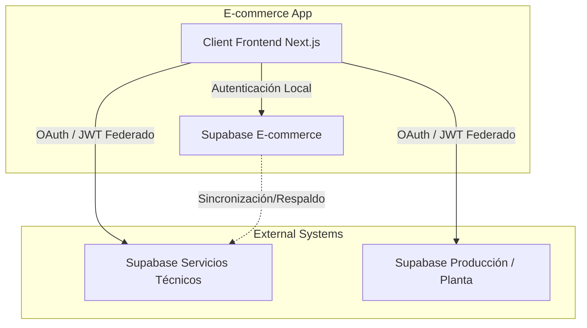

# Especificación: Integración de Servicios, Seguimiento de Pedidos y OAuth

> [!IMPORTANT]
> **Estrategia Condensada del Segmento**:
> Implementar un modelo de arquitectura federada basado en identidad única mediante Supabase OAuth. Permite al cliente autenticado en la tienda consultar el avance de fabricación de sus productos directamente en la base de datos de planta y agendar visitas técnicas en la base de datos de servicios postventa, sin duplicar esquemas de usuarios ni comprometer la seguridad entre sistemas.

Este documento detalla la integración del e-commerce con los otros sistemas y bases de datos de la empresa en Supabase para el agendamiento de servicios y el rastreo de pedidos en la planta de producción.

---

## 1. Arquitectura de Supabase Multi-Proyecto (Federada)

El e-commerce se conectará a tres proyectos independientes de Supabase en la empresa para garantizar modularidad y seguridad:

---

## 2. Flujo de Autenticación y OAuth de Cliente Final

Para permitir que el cliente consulte sus servicios e historial de planta de forma segura sin re-autenticarse en cada aplicación, se utilizará una estrategia de autenticación basada en JWT/OAuth de Supabase:

1.  **Identidad Centralizada:** El usuario inicia sesión en la base de datos de `Supabase E-commerce` (User Auth principal).
2.  **Generación de Tokens de Acceso:** La aplicación del e-commerce solicita/firma un token JWT que es compatible o está validado por las APIs de los proyectos de `Supabase Servicios` y `Supabase Producción`.
3.  **Configuración de Políticas RLS (Row Level Security):**
    *   Las bases de datos externas de Servicios y Producción verificarán la firma del JWT emitido por la identidad centralizada.
    *   Las políticas RLS controlarán que el usuario (`auth.uid()`) solo pueda realizar consultas e inserciones sobre sus propios registros asociados.

---

## 3. Módulo 1: Agendamiento de Servicios

Permite al cliente final solicitar instalaciones, mantenimientos o revisiones de sus productos adquiridos (ej: jacuzzis, muebles, lavamanos).

### Flujo de Datos
*   El cliente visualiza su historial de compras en su perfil del e-commerce.
*   Al seleccionar "Solicitar Servicio", el frontend de Next.js lee la base de datos de `Supabase Servicios` para obtener disponibilidad de técnicos y fechas.
*   El agendamiento se inserta directamente en el proyecto `Supabase Servicios`.
*   **Respaldo:** Se mantiene una tabla espejo en `Supabase E-commerce` para registrar los metadatos básicos del servicio asociado a la orden de compra original.

---

## 4. Módulo 2: Seguimiento de Pedidos en Planta (Manufactura)

Muestra al cliente el estado exacto de la fabricación de su producto de mármol sintético o madera RH en la línea de producción de Firplak.

### Estados de Producción a Consultar (en Supabase Planta)
El sistema consultará a la base de datos de producción el estado actual del pedido mediante el número de orden de venta de SAP o de e-commerce, mapeando los siguientes estados en el frontend:

1.  **En Cola de Programación:** Orden recibida y planificada para producción.
2.  **En Moldeo/Fundición:** Proceso de inyección y moldeo del mármol sintético.
3.  **En Carpintería/Ensamble:** Ensamble del mueble RH o pulido de piezas.
4.  **Control de Calidad:** Inspección física del acabado estético y estructural.
5.  **Empaque y Despacho:** Producto empacado y entregado a la transportadora (listo para envío).

### Componente UX (Línea de Tiempo Dinámica)
Se implementará una barra de progreso visual en el área de cliente del e-commerce que leerá en tiempo real las actualizaciones de estado emitidas por la base de datos de planta.
