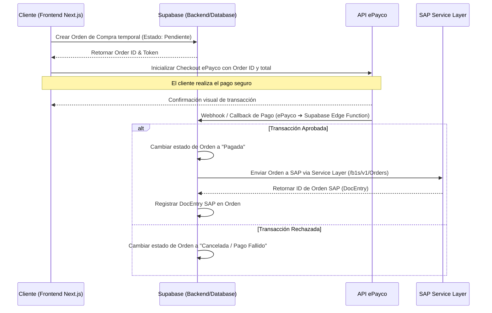

# Especificación: Pasarela de Pagos e Integración Financiera

Este documento detalla la especificación para el motor de pagos, pasarelas y financiamiento dentro del e-commerce.

---

## 1. Pasarela de Pagos (ePayco)

ePayco actuará como la pasarela de pagos principal para transacciones directas.

### Métodos Soportados
*   **Tarjetas de Crédito y Débito:** Visa, Mastercard, American Express, Diners Club.
*   **PSE (Pagos Seguros en Línea):** Transferencias interbancarias directas de cuentas de ahorro o corrientes en Colombia.

### Modelo de Integración
Se implementará una integración híbrida utilizando el checkout de ePayco (para mayor seguridad y cumplimiento PCI-DSS) con comunicación por Webhooks para el backend:

---

## 2. Financiamiento (ADDI)

ADDI se integrará como una opción de financiamiento a plazos ("Compra ahora, paga después").

### UX / Frontend
*   **Ficha de Producto:** Mostrar un widget con la cuota simulada de Addi (ej: *"O paga en 3 cuotas de $XX.XXX sin interés con Addi"*).
*   **Checkout:** Opción de pago "Pagar con Addi".

### Integración Técnica
1.  **Redirección:** Al seleccionar Addi, se crea la orden en Supabase como "Pendiente" y se redirige al cliente al portal de Addi con los datos de compra.
2.  **Confirmación:** Addi enviará una notificación vía Webhook a la Edge Function de Supabase para validar la aprobación del crédito.
3.  **Procesamiento:** Una vez aprobado, el flujo en backend procesa e inyecta la orden en SAP igual que un pago de ePayco.
