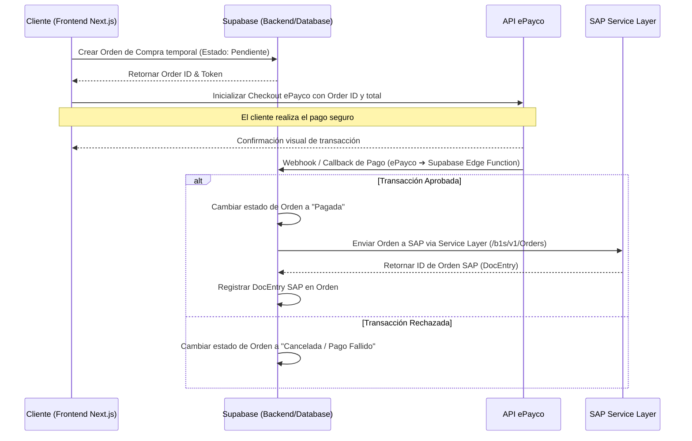

# Especificación: Pasarela de Pagos e Integración Financiera

Este documento detalla la especificación para el motor de pagos, pasarelas y financiamiento dentro del e-commerce.

---

## 1. Pasarela de Pagos (ePayco)

ePayco actuará como la pasarela de pagos principal para transacciones directas.

### Métodos Soportados
*   **Tarjetas de Crédito y Débito:** Visa, Mastercard, American Express, Diners Club.
*   **PSE (Pagos Seguros en Línea):** Transferencias interbancarias directas de cuentas de ahorro o corrientes en Colombia.

### Modelo de Integración
Se implementará una integración híbrida utilizando el checkout de ePayco (para mayor seguridad y cumplimiento PCI-DSS) con comunicación por Webhooks para el backend:

---

## 2. Financiamiento (ADDI)

ADDI se integrará como una opción de financiamiento a plazos ("Compra ahora, paga después").

### UX / Frontend
*   **Ficha de Producto:** Mostrar un widget con la cuota simulada de Addi (ej: *"O paga en 3 cuotas de $XX.XXX sin interés con Addi"*).
*   **Checkout:** Opción de pago "Pagar con Addi".

### Integración Técnica
1.  **Redirección:** Al seleccionar Addi, se crea la orden en Supabase como "Pendiente" y se redirige al cliente al portal de Addi con los datos de compra.
2.  **Confirmación:** Addi enviará una notificación vía Webhook a la Edge Function de Supabase para validar la aprobación del crédito.
3.  **Procesamiento:** Una vez aprobado, el flujo en backend procesa e inyecta la orden en SAP igual que un pago de ePayco.

---

## 3. Requerimientos y Preguntas Clave: Plataforma de Pagos

Para garantizar una arquitectura sólida e integración sin fricciones entre la pasarela, la base de datos y el ERP (SAP), se deben definir los siguientes requerimientos y preguntas clave durante la fase de desarrollo:

### A. Impuestos, Moneda y Aspectos Financieros
* **Manejo de Impuestos y Tasas:** ¿Cómo se calculará y discriminará el IVA (19%, 5% o exento) por ítem antes de enviar la orden a ePayco/ADDI?
* **Retenciones:** En compras B2B o según la parametrización de clientes, ¿se aplicarán retenciones (ReteFuente, ReteICA, ReteIVA) directamente en la pasarela o únicamente se registrarán en SAP?
* **Moneda:** ¿Se procesará exclusivamente en COP (Pesos Colombianos) o la pasarela debe contemplar cobros multi-moneda (USD) para clientes internacionales?
* **Cupones y Promociones:** ¿Cómo afectarán los cupones de descuento a la base gravable y cómo se desglosa el descuento en el resumen enviado a la pasarela?

### B. Ciclo de Vida de Transacciones e Idempotencia
* **Idempotencia en Webhooks:** ¿Cómo aseguramos que la Edge Function de Supabase no procese dos veces un webhook repetido de ePayco o ADDI para evitar la duplicación de pedidos en SAP?
* **Manejo de Respuestas Asíncronas (PSE):** PSE puede tardar hasta 24 horas en responder con estado final ("Pendiente" -> "Aprobado" / "Rechazado"). ¿Cuál es la política para reservar stock y cómo se notifica al usuario si el pago PSE finaliza en estado rechazado posteriormente?
* **Anulaciones y Reembolsos:** ¿Se requerirá la gestión de devoluciones, anulaciones y reembolsos (totales o parciales) directamente desde la plataforma administrativa o se operarán directamente en el portal de la pasarela y SAP?

### C. Reserva de Inventario y Concurrencia
* **Momento de Reserva de Stock:** ¿El stock se bloquea en la base de datos temporalmente al crear la orden pendiente ("Checkout iniciado") o se valida y descuenta únicamente cuando la pasarela retorna el estado "Aprobado"?
* **Tiempo de Expiración de Órdenes:** ¿Cuál es el tiempo de vida máximo (TTL) de una orden en estado "Pendiente" antes de liberar el inventario bloqueado?

---

## 4. Requerimientos y Preguntas Clave: Estructuración de Tablas de Producto

La estructura de tablas de producto en la base de datos debe contemplar todos los atributos necesarios para la liquidación de pagos, cotización de envíos y mapeo exacto con el ERP:

### A. Atributos Financieros e Impuestos por SKU
* **Definición de IVA por SKU:** ¿El porcentaje de IVA y el código fiscal (`TaxCode` en SAP) deben vivir en `PRODUCT_VARIATION` (SKU) para permitir productos con diferentes regímenes tributarios?
* **Mapeo de SKUs con SAP ItemCode:** ¿El identificador principal de SKU en `PRODUCT_VARIATION` coincide 1:1 con el `ItemCode` de SAP para evitar inconsistencias en la inyección del pedido?

### B. Cotización de Fletes y Logística
* **Dimensiones y Peso por SKU:** Para calcular el valor del envío antes del checkout, ¿las tablas `PRODUCT_VARIATION` y `DIMENSION` incluyen peso físico (`weight_kg`) y peso volumétrico para la integración con transportadoras?
* **Costo de Empaque / Manejo Especial:** ¿Existen SKUs (ej: Spas o Jacuzzis de gran volumen) que requieran un recargo especial de logística o manejo que deba sumarse a la base de liquidación del pago?

### C. Combos, Bundles y Mix & Match
* **Desglose de Kits/Combos:** Cuando un cliente compra un combo o un lavamanos + mueble (Mix & Match), ¿se envía a la pasarela y a SAP como una sola línea con un SKU genérico o desglosado en múltiples líneas con sus respectivos SKUs, precios e impuestos individuales?
* **Asignación de Descuentos en Bundles:** En caso de desglosar combos, ¿cómo se prorratea el descuento entre cada SKU componente?

### D. Listas de Precios y Perfiles de Cliente
* **Relación SKU - Lista de Precios (`PRICE_LIST`):** ¿Cómo se consulta dinámicamente el precio de un SKU según la sesión del usuario (Público general, Distribuidor B2B, Constructor) al momento de armar el payload del checkout?
