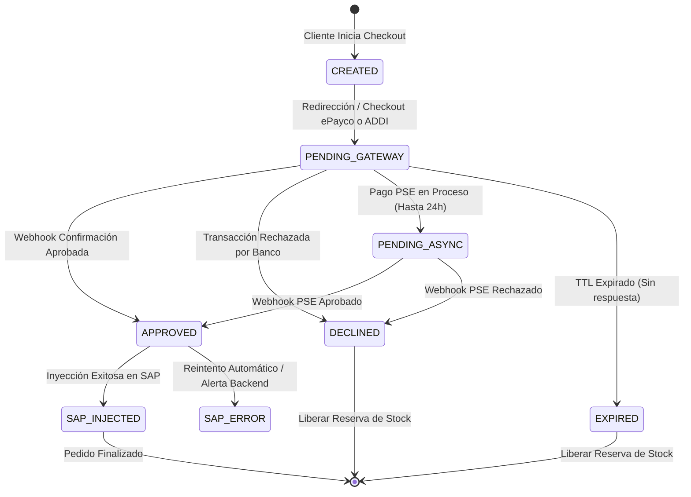

# Recomendaciones de Arquitectura: Productos, Stocks y Pasarela de Pagos

Este documento compila las buenas prácticas y recomendaciones para el diseño y desarrollo del motor de productos, control de inventario y la integración con la pasarela de pagos en el e-commerce de Firplak.

---

## 1. Manejo de Tipos de Productos y Variaciones

Para cubrir la complejidad del catálogo de Firplak (baños, cocinas, spas, muebles y accesorios), la estructura de datos debe soportar múltiples modalidades de venta:

### A. Clasificación de Productos
* **Producto Simple:** SKU con atributos fijos (ej: grifería, accesorio estándar).
* **Producto Variable (Multivariante):**
  * **Estructura:** Agrupador padre (`PRODUCT`) con múltiples combinaciones hijo (`PRODUCT_VARIATION`).
  * **Ejes de Variación:** Color (blanco, negro, taupe), Material (Mármol sintético, Quartzstone, Resina, RH) y Dimensiones (Largo x Ancho x Profundidad con su respectiva tolerancia de fabricación).
  * **Atributos Dinámicos (`jsonb`):** Campos específicos según la categoría (ej: para Spas/Jacuzzis: número de jets, voltaje, certificación RETIE, capacidad en litros; para Muebles: tipo de riel, cajones).
* **Productos Bajo Pedido / Fabricación (Make-to-Order):**
  * Productos sin stock físico continuo en bodega que requieren orden de fabricación en planta.
  * **Recomendación:** El SKU debe tener la bandera `is_make_to_order: true` y un parámetro `lead_time_days` para informar al cliente la fecha estimada de entrega sin bloquear la venta.
* **Combos y Kits Cerrados:**
  * Paquetes comerciales predefinidos (ej: Combo Mueble + Lavamanos + Grifería).
  * **Recomendación:** Manejar una entidad `PRODUCT_BUNDLE` que vincule el SKU del combo con los SKUs componentes, permitiendo enviar la orden desglosada a SAP con su respectivo prorrateo de precio e IVA.
* **Mix & Match (Combinabilidad Dinámica):**
  * Permite al usuario armar su conjunto personalizado comprobando compatibilidad física mediante la tabla `COMPATIBILITY`.

---

## 2. Manejo de Inventarios y Control de Stock

El control de inventario debe evitar la sobreventa (overselling) sin bloquear stock indefinidamente ante pagos abandonados.

### A. Estrategia de Reserva de Inventario
1. **Reserva Temporal / Soft Reservation (Checkout Iniciado):**
   * Al iniciar el checkout (creación de la orden en estado `PENDING_PAYMENT`), se genera un registro en la tabla `stock_reservations` con un **TTL (Time-To-Live) de 15 minutos**.
   * El stock disponible visible para otros usuarios se calcula como: `Stock Disponible = Stock Físico - Reservas Activas`.
2. **Reserva Definitiva / Hard Reservation (Pago Aprobado):**
   * Al recibir la confirmación del pago (Webhook `APPROVED`), la reserva se convierte en descuento definitivo de stock y se inyecta la orden de venta a SAP.
3. **Liberación Automática (Timeout o Rechazo):**
   * Si la transacción es rechazada o el usuario abandona el checkout pasados los 15 minutos, un Cron / Job de Supabase elimina la reserva y devuelve el stock a la disponibilidad pública.

### B. Sincronización con SAP ERP
* **Stock de Seguridad (Buffer):** Mantener un umbral mínimo de inventario (`safety_stock`) en Supabase para proteger la venta online frente a consumos simultáneos en canales tradicionales.
* **Mapeo de Almacenes:** Asignar el stock disponible al código de almacén (Warehouse Code) correspondiente en SAP.

---

## 3. Ciclo de Vida de Pagos e Integraciones

La integración con ePayco y ADDI debe contemplar todos los escenarios de respuesta y garantizar la consistencia transaccional con la base de datos y SAP.

### A. Estados de la Transacción

### B. Casos de Uso y Recomendaciones

1. **Éxito (Pago Aprobado):**
   * **Recomendación:** La Edge Function valida la firma de la pasarela (`P_SIGNATURE`), cambia el estado del pedido a `APPROVED`, libera la reserva temporal marcándola como consumida e invoca la API del Service Layer de SAP (`/b1s/v1/Orders`).
2. **Rechazo (Pago Fallido / Tarjeta Invalida):**
   * **Recomendación:** Registrar la causa del rechazo, notificar al usuario en el frontend con opción de reintentar con otro medio de pago y liberar la reserva de stock asociada.
3. **Confirmación Asíncrona (PSE y ADDI):**
   * **Recomendación:** Mantener la orden en estado `PENDING_ASYNC`. Extender el TTL de reserva de stock de 15 minutos a un máximo parametrizado (ej: 12-24 horas) mientras el banco confirma la transacción. Notificar al usuario por correo electrónico una vez recibido el webhook final.
4. **Idempotencia en Webhooks:**
   * **Recomendación:** Guardar el ID de transacción de la pasarela (`x_ref_payco` o ID de transacción ADDI) en una columna con restricción `UNIQUE` en la tabla `payments`. Si la pasarela reenvía el webhook, Supabase responderá `200 OK` inmediatamente sin reincidir en la inyección a SAP.
5. **Reembolsos y Anulaciones (RMA):**
   * **Recomendación:** Ante un reembolso aprobado (devolución o garantía), la plataforma debe emitir la solicitud de anulación a la pasarela e inyectar la Nota Crédito correspondiente en SAP (`/b1s/v1/CreditNotes`) para mantener la contabilidad en regla.

---

## 4. Evaluación de Plataformas de E-Commerce y Ampliación de Capacidades

A continuación se analizan las plataformas de e-commerce más representativas y la infraestructura requerida para extender sus capacidades ante los requerimientos de Firplak (catálogo multivariante relacional, tolerancias físicas, Mix & Match e integración directa con SAP Business One):

### A. WooCommerce (WordPress)
* **Puntos Fuertes Nativos:** Ecosistema maduro de plugins locales para pasarelas en Colombia (ePayco, ADDI).
* **Limitaciones para Firplak:** Saturación de la tabla `wp_postmeta` con miles de SKUs y variaciones, lentitud en consultas Ajax complejas y falta de control transaccional estricto para reservas de inventario concurrentes.
* **Ampliación de Capacidades Requerida:**
  * **Motor de Productos:** Crear tablas relacionales personalizadas en MySQL (omitiendo el esquema estándar de postmeta) o implementar un microservicio externo para el catálogo.
  * **Mix & Match:** Desarrollar un plugin PHP/JS a medida con un canvas o visualizador interactivo y validaciones de compatibilidad mediante API.
  * **Integración ERP / Pagos:** Desarrollar un plugin personalizado de Sync que capture eventos de pago e inyecte la orden en el Service Layer de SAP evitando bloqueos del servidor WordPress.

### B. Shopify / Shopify Plus
* **Puntos Fuertes Nativos:** Alta estabilidad SaaS, tasa de conversión optimizada en checkout y plugins existentes para ePayco/ADDI.
* **Limitaciones para Firplak:** Restricción nativa de 100 variantes por producto y 3 opciones de atributos en plan estándar, además de poca flexibilidad para lógica relacional de compatibilidad física entre productos independientes.
* **Ampliación de Capacidades Requerida:**
  * **Estructuración de Productos:** Utilizar **Shopify Metafields** y **Metaobjects** avanzados o migrar a una arquitectura **Headless (Shopify Storefront API)** para consultar la matriz de atributos dinámicos (`jsonb`-like).
  * **Mix & Match:** Desarrollar una *Shopify Custom App* en React/Node que valide las compatibilidades físicamente antes de añadir el paquete al carrito.
  * **Integración SAP:** Implementar un middleware (ej: Supabase Edge Functions / AWS Lambda) que escuche el webhook `orders/paid` de Shopify, valide reglas de negocio y consuma el Service Layer (`/b1s/v1/Orders`).

### C. Adobe Commerce / Magento Enterprise
* **Puntos Fuertes Nativos:** Motor B2B robusto, soporte nativo de listas de precios complejas, múltiples almacenes y catálogos masivos de SKUs.
* **Limitaciones para Firplak:** Alta complejidad técnica, costos elevados de licencias e infraestructura, y curva de desarrollo lenta para personalizar la experiencia visual de Mix & Match.
* **Ampliación de Capacidades Requerida:**
  * **Front-end:** Reemplazar el frontend nativo por Luma/PWA Studio o un frontend desacoplado en React para el visualizador 2D de Mix & Match.
  * **Integración SAP:** Configurar conectores de Enterprise Service Bus (ESB) o Magento Web APIs (REST/GraphQL) para sincronizar inventario y pedidos con SAP.

### D. Stack Propuesto: Headless A Medida (Next.js + Supabase + SAP Service Layer)
* **Puntos Fuertes:** **Recomendación principal para Firplak**. Brinda rendimiento ultrarrápido (SSR/ISR), total libertad para la matriz de compatibilidad Mix & Match, soporte nativo de `jsonb` en PostgreSQL para fichas técnicas y RETIE, y costo optimizado de infraestructura.
* **Ampliación de Capacidades Requerida:**
  * **Módulo de Checkout & Pasarelas:** Desarrollo del flujo de pago en Next.js consumiendo las SDKs/APIs de ePayco y ADDI mediante Edge Functions seguras con manejo estricto de idempotencia.
  * **Panel Administrativo:** Integración de una consola de administración (ej: Refine.dev o Supabase Studio) para la gestión del catálogo, reglas de compatibilidad y trazabilidad de órdenes inyectadas a SAP.

