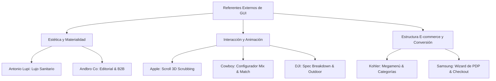

# Referentes Externos de GUI / UI / UX - Benchmark Firplak E-commerce

> [!IMPORTANT]
> **Estrategia Condensada del Segmento**:
> Compendio unificado de los 7 referentes internacionales de UI/UX seleccionados como pilar de diseño para el nuevo ecosistema web e-commerce de Firplak. Este documento centraliza los patrones de interacción (scroll storytelling, configuradores 3D, megamenú e-commerce, dirección de arte de lujo y wizards de compra transaccional) que guiarán la construcción de la Home Page, PDPs, Mix & Match y Checkout.

---

## 📌 Tabla Resumen de Referentes Externos

| Referente | URL Oficial | Módulo Destinado en Firplak | Foco GUI / UX Principal |
| :--- | :--- | :--- | :--- |
| **Apple AirPods Pro** | `https://www.apple.com/airpods-pro/` | `pagina_producto.md`, `hidromasajes.md` | Scroll-driven 3D Scrubbing, Despiece interactivo de producto, Micro-callouts flotantes. |
| **Andbro Co** | `https://www.andbro.co/works` | `carpinteria_obra.md`, `sistema_diseno.md` | Retícula editorial minimalista, espacios en blanco, portfolio B2B de arquitectura. |
| **Antonio Lupi** | `https://www.antoniolupi.it/en/home` | `sistema_diseno.md`, `accesorios.md` | Dirección de arte de lujo sanitario italiano, materialidad y texturas de alta gama. |
| **Kohler** | `https://www.kohler.com/en` | `pagina_inicio.md`, `conceptos_catalogo.md` | Arquitectura de Megamenú masivo, navegación B2C/B2B e inspirador por ambiente. |
| **Cowboy E-Bikes** | `https://cowboy.com/` | `mix_and_match.md`, `sistema_diseno.md` | Personalizador 360° en tiempo real, cambio dinámico de acabados y Kinetic Motion UI. |
| **DJI Mavic 3 Pro** | `https://www.dji.com/global/mavic-3-pro` | `hidromasajes.md`, `zona_outdoor.md` | Exposición de ingeniería pesada, fichas técnicas interactivas y visualización de data. |
| **Samsung Galaxy S25 Ultra** | `https://www.samsung.com/us/smartphones/galaxy-s25-ultra/buy/` | `pagina_producto.md`, `pagos_e_integraciones.md` | Wizard de compra por pasos, cálculo dinámico de cuotas/financiamiento y add-ons. |

---

## 🎯 Matriz de Aplicación en la Arquitectura de Firplak

---

## 1. Apple AirPods Pro (Scroll Storytelling & 3D Interactive Breakdown)

- **URL Oficial**: `https://www.apple.com/airpods-pro/`
- **Categoría GUI**: Scroll-Driven Cinematic Storytelling & Interactive Product Breakdown.

### Principios Visuales y UI Destacados
1. **Scrubbing Canvas (Secuencia de Fotogramas 3D)**:
   - Avance fotograma a fotograma vinculado al desplazamiento vertical del usuario (`scrollY`).
   - Rotación suave y despiece dinámico del producto (explosionado de componentes).
2. **Tipografía Monumental y Alto Contraste**:
   - Encabezados en gran escala (*display size*) con máxima legibilidad sobre fondo oscuro (`#000000` / `#0B0B0C`).
3. **Hotspots & Micro-callouts Flotantes**:
   - Tarjetas flotantes fijas (*sticky overlay*) que aparecen y desaparecen con transiciones de opacidad y escala según el rango de scroll.
4. **Sub-bar de Navegación Persistente (Sticky Header Bar)**:
   - Header secundario fijo en la parte superior con el nombre del modelo, anclas de sección y botón CTA "Comprar" siempre visible.

### Aplicación en Firplak
- **PDP de Spas e Hidromasajes (`hidromasajes.md`)**: Animación 3D en scroll que despieza el vaso de hidromasaje, mostrando la estructura reforzada en mármol sintético, motobomba silenciosa, jets de hidromasaje y acometida.
- **PDP de Tinas y Lavamanos (`pagina_producto.md`)**: Comparativa interactiva deslizable que muestra el acabado superficial *Easy Clean* y la resistencia al rayado/manchas.
- **Barra Sticky Fija**: Mantiene visible la línea (ej. *Spa Ibiza 5 Personas*), precio actual y botón "Agregar al Carrito" / "Personalizar".

---

## 2. Andbro Co (Editorial Grid & Portfolio B2B de Arquitectura)

- **URL Oficial**: `https://www.andbro.co/works`
- **Categoría GUI**: Editorial Portfolio & High-End B2B Grid Architecture.

### Principios Visuales y UI Destacados
1. **Retícula Asimétrica y Espacio Negativo (Whitespace)**:
   - Uso generoso de márgenes y espaciado pasivo que otorga un carácter exclusivo, limpio y altamente profesional.
   - Distribución irregular pero armónica de tarjetas de proyectos, evitando el aspecto cuadriculado rígido tradicional.
2. **Hover State & Image Reveal Sofisticado**:
   - Cursor personalizado interactivo que muestra vistas previas o etiquetas informativas (ej. *Ver Proyecto*, *Materiales Usados*) al pasar sobre cada proyecto.
3. **Tipografía Sans-serif de Alta Densidad Visual**:
   - Uso de tipografías geométricas o neo-grotescas en pesos contrastantes (Ultra Light vs Medium) que comunican precisión arquitectónica.

### Aplicación en Firplak
- **Carpintería de Obra B2B (`carpinteria_obra.md`)**: Galería de casos de éxito B2B para constructoras (Amarilo, Marval, Bolívar) mostrando cocinas, lavaderos y baños instalados a gran escala.
- **Showrooms e Inspiración (`pagina_inicio.md`)**: Tarjetas interactivas en la Home donde al pasar el cursor se revela la foto real de un espacio amueblado con Firplak.

---

## 3. Antonio Lupi (Lujo Sanitario Italiano & Dirección de Arte)

- **URL Oficial**: `https://www.antoniolupi.it/en/home`
- **Categoría GUI**: High-End Luxury Sanitaryware & Architectural Interior Design.

### Principios Visuales y UI Destacados
1. **Estética de Lujo Arquitectónico e Interiorismo**:
   - Paleta cromática basada en tonos orgánicos: piedra natural, basalto, arcilla, blanco satén, negro mate y maderas oscuras.
   - Enfoque directo en la escultura del producto (lavamanos independientes, tina exenta, espejos retroiluminados).
2. **Fotografía Inmersiva Full-bleed**:
   - Renderizados y fotografías de arquitectura residencial de vanguardia con iluminación natural dramática y sombras suaves.
3. **Navegación por Materialidad y Colecciones**:
   - Clasificación directa por tipo de material exclusivo, destacando las propiedades de resistencia, higiene y suavidad al tacto.

### Aplicación en Firplak
- **Storytelling de Materiales (`sistema_diseno.md` & `conceptos_catalogo.md`)**: Bloque dedicado a la tecnología del Mármol Sintético Firplak (textura ultra-suave, no poroso, reparación de rayones) y Quartzstone.
- **Hero Banner Inmersivo (`pagina_inicio.md`)**: Hero de la Home Page con ambientaciones de baño estilo Spa de lujo.
- **Líneas Premium de Baño (`pagina_producto.md` & `accesorios.md`)**: Galería visual donde el lavamanos o la tina es la pieza central del espacio.

---

## 4. Kohler (Megamenú E-commerce & Navegación por Ambiente)

- **URL Oficial**: `https://www.kohler.com/en`
- **Categoría GUI**: Global Kitchen & Bath E-commerce Navigation & Professional Catalog Hierarchy.

### Principios Visuales y UI Destacados
1. **Megamenú Multinivel Categorizado**:
   - Menú de navegación principal con jerarquía amplia: Categoría Principal -> Subcategoría -> Tipología de Instalación -> Destacados.
   - Inclusión de miniaturas visuales dentro del mismo menú desplegable para guiado rápido del usuario.
2. **Navegación Dual B2C / B2B**:
   - Accesos directos diferenciados para Propietarios de Hogar, Plomeros/Instaladores y Diseñadores/Especificadores Profesionales.
3. **Módulo de Inspiración "Shop the Look"**:
   - Capacidades de exploración por estilos (Moderno, Industrial, Minimalista) con compra directa de todos los elementos del ambiente.

### Aplicación en Firplak
- **Megamenú Global (`pagina_inicio.md`)**: Menú dividiendo *Baños* (Lavamanos, Muebles, Tinas), *Cocinas*, *Zona de Labores*, *Outdoor/Spas* y *Servicios*.
- **Hub de Instaladores y Repuestos (`servicios.md`)**: Módulo de servicios de Pre-inspección e Instalación Certificada Firplak, agendamiento online y manuales técnicos.
- **Shop the Look (`pagina_inicio.md` & `mix_and_match.md`)**: Galería en la Home para comprar el combo completo de baño (Mueble + Lavamanos + Grifería + Espejo).

---

## 5. Cowboy E-Bikes (Personalizador 360° en Vivo & Motion UI)

- **URL Oficial**: `https://cowboy.com/`
- **Categoría GUI**: Real-Time Product Customizer, Kinetic UI Motion & Interactive Specs.

### Principios Visuales y UI Destacados
1. **Configurador Dinámico de Producto 360°**:
   - Cambio instantáneo del acabado gráfico del producto en respuesta a la selección del usuario.
   - Renderizado ultrarrápido sin recarga de página ni parpadeos.
2. **Kinetic Micro-Interactions (Motion Physics)**:
   - Animaciones suaves con física de resorte (*spring animations*) al activar o desactivar opciones.
   - Indicadores dinámicos que actualizan el precio total con transiciones numéricas rotativas (*count-up / count-down*).
3. **Selector Flotante de Variantes**:
   - Panel modal/drawer limpio con pill selectors para colores y opciones complementarias.

### Aplicación en Firplak
- **Visualizador Mix & Match (`mix_and_match.md`)**: Selección en tiempo real del acabado del mueble de madera RH (Duna, Roble, Blanco), tipo de lavamanos y modelo de grifería.
- **Precio Animado Dinámico (`pagina_producto.md` / `mix_and_match.md`)**: Actualización animada del precio acumulado según los componentes agregados al combo.
- **Swatches Interactivos (`sistema_diseno.md`)**: Selectores de color interactivos para lavamanos y muebles con retroalimentación inmediata.

---

## 6. DJI Mavic 3 Pro (Ingeniería Pesada & Fichas Técnicas Complejas)

- **URL Oficial**: `https://www.dji.com/global/mavic-3-pro`
- **Categoría GUI**: Engineering Feature Showcase, Technical Data Visualization & Dark Mode Precision UI.

### Principios Visuales y UI Destacados
1. **Desglose de Ingeniería Compleja (Tech Spec Overlays)**:
   - Visualización por capas de las características mecánicas y eléctricas pesadas con diagramas vectoriales interactivos.
2. **Estética Dark Mode de Alta Precisión**:
   - Fondo oscuro profundo con acentos de color vibrante (dorado, cyan, blanco puro) para denotar tecnología de vanguardia y durabilidad industrial.
3. **Tabla de Especificaciones Dinámica**:
   - Matriz completa de especificaciones organizadas por pestañas collapsibles (Dimensiones, Acometida Eléctrica, Rendimiento, Garantía).

### Aplicación en Firplak
- **Desglose de Spas e Hidromasajes (`hidromasajes.md` & `zona_outdoor.md`)**: Capas de refuerzo en mármol sintético, sistema de aislamiento térmico, distribución de tubería hídrica y jets.
- **Ficha de Instalación (`zona_outdoor.md`)**: Tabla collapsible de acometida eléctrica (110V/220V), consumo de agua (litros), resistencia de carga estructural y especificación de acero inoxidable 304.

---

## 7. Samsung Galaxy S25 Ultra (Wizard PDP, Financiamiento & Venta Cruzada)

- **URL Oficial**: `https://www.samsung.com/us/smartphones/galaxy-s25-ultra/buy/`
- **Categoría GUI**: High-Conversion E-commerce Purchase Wizard, Trade-in & Dynamic Financing UI.

### Principios Visuales y UI Destacados
1. **Step-by-Step Purchase Wizard (Configurador Guiado de Compra)**:
   - Pasos secuenciales integrados dentro de la PDP: 1) Dimensión, 2) Acabado/Color, 3) Servicio Técnico / Garantía, 4) Accesorios Compatibles.
2. **Desglose de Financiamiento Dinámico**:
   - Muestra instantánea del valor total de contado vs pago a cuotas mensuales en tiempo real (ej. *Desde $120.000/mes con ADDI*).
3. **Barra Fija Inferior / Lateral de Resumen (Sticky Drawer)**:
   - Resumen en vivo de la configuración seleccionada con desglose de descuentos, precio final y CTA claro "Comprar Ahora" / "Agregar al Carrito".

### Aplicación en Firplak
- **Wizard Comercial PDP (`pagina_producto.md`)**: Seleccionar tamaño de lavamanos/mueble -> Elegir acabado de madera/color -> Añadir kit de grifería compatible -> Añadir Servicio de Instalación Certificada.
- **Simulador de Crédito (`pagos_e_integraciones.md`)**: Cálculo transparente de cuotas mensuales (ADDI, ePayco, PSE) en la PDP.
- **Cross-selling de Accesorios (`accesorios.md` & `griferia_plomeria.md`)**: Checkbox interactivo en la PDP para agregar el desagüe/sifón y la grifería adecuada antes de finalizar la compra.
