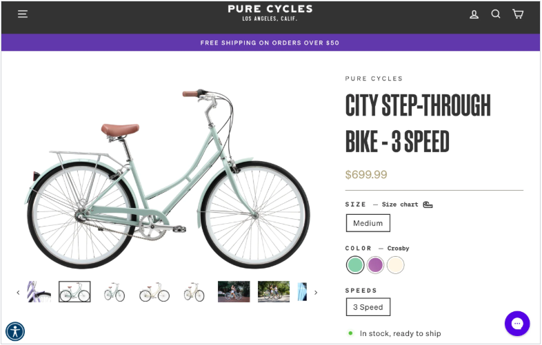
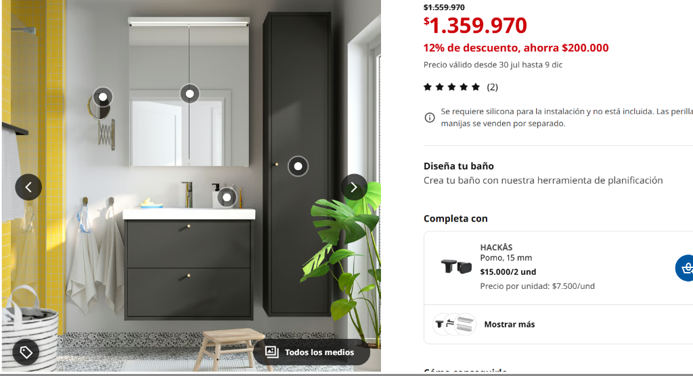
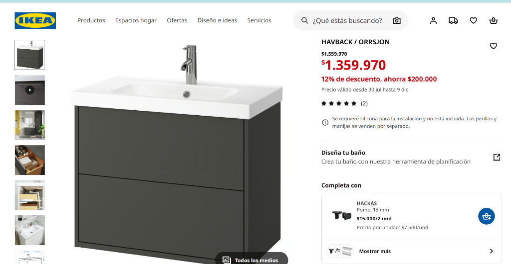

# Referentes Externos de GUI, UI y UX - Benchmark Firplak E-commerce

> [!IMPORTANT]
> **Estrategia Condensada del Segmento**:
> Compendio maestro y unificado del banco de referentes externos (8 pilares internacionales de arquitectura e interacción GUI + benchmarks curados de Awwwards, comercio de nicho e investigación académica UX de Nielsen Norman Group) seleccionados para guiar las decisiones de diseño en el ecosistema web e-commerce de Firplak. Centraliza patrones de interacción (scroll storytelling, configuradores 3D, megamenús, dirección de arte de lujo, wizards de compra, micro-interacciones, física de movimiento y hegemonía fotográfica) junto con las directrices de arte y producto de la dirección general.

---

## 📌 Tablas Resumen de Referentes Externos

### 1. Pilares de Arquitectura, Interacción y GUI Transaccional

| Referente | URL Oficial | Módulo Destinado en Firplak | Foco GUI / UX Principal |
| :--- | :--- | :--- | :--- |
| **Apple AirPods Pro** | `https://www.apple.com/airpods-pro/` | `pagina_producto.md`, `hidromasajes.md` | Scroll-driven 3D Scrubbing, Despiece interactivo de producto, Micro-callouts flotantes. |
| **Andbro Co** | `https://www.andbro.co/works` | `carpinteria_obra.md`, `sistema_diseno.md` | Retícula editorial minimalista, espacios en blanco, portfolio B2B de arquitectura. |
| **Antonio Lupi** | `https://www.antoniolupi.it/en/home` | `sistema_diseno.md`, `accesorios.md` | Dirección de arte de lujo sanitario italiano, materialidad y texturas de alta gama. |
| **Kohler** | `https://www.kohler.com/en` | `pagina_inicio.md`, `conceptos_catalogo.md` | Arquitectura de Megamenú masivo, navegación B2C/B2B e inspirador por ambiente. |
| **Cowboy E-Bikes** | `https://cowboy.com/` | `mix_and_match.md`, `sistema_diseno.md` | Personalizador 360° en tiempo real, cambio dinámico de acabados y Kinetic Motion UI. |
| **DJI Mavic 3 Pro** | `https://www.dji.com/global/mavic-3-pro` | `hidromasajes.md`, `zona_outdoor.md` | Exposición de ingeniería pesada, fichas técnicas interactivas y visualización de data. |
| **Samsung Galaxy S25 Ultra** | `https://www.samsung.com/us/smartphones/galaxy-s25-ultra/buy/` | `pagina_producto.md`, `pagos_e_integraciones.md` | Wizard de compra por pasos, cálculo dinámico de cuotas/financiamiento y add-ons. |
| **Bullfrog Spas** | `https://www.bullfrogspas.com/design-studio/` | `hidromasajes.md`, `zona_outdoor.md` | Configurador 3D interactivo de jacuzzis/spas, personalización modular de JetPaks, acabados de casco y faldón. |

### 2. Banco Curado Awwwards, Benchmarks de Nicho e Investigación Académica UX

| Referente | URL Oficial | Categoría / Nicho | Foco / Patrón Específico Aplicable a Firplak |
| :--- | :--- | :--- | :--- |
| **Material Kitchen** | `https://materialkitchen.com` | Baños, cocinas y materiales | Megamenú con swatches visibles en miniatura de grilla y propuesta de garantía hero en `cocinas.md`.[^1] |
| **Provider Store** | `https://www.providerstore.com.au` | Baños, cocinas y materiales | Shop by Collection/Brand, umbral de envío repetido en recorrido y hegemonía fotográfica estricta.[^2] |
| **Arteriors Home** | `https://www.arteriorshome.com` | Baños, cocinas y materiales | 4+ ángulos por producto, cotas dimensionales inmediatas en tarjeta y arquitectura de catálogo ultra limpia.[^3] |
| **Bombon (Royal Swedish Candy)** | `https://bombon.rs` | Ecommerce lúdico / experiencial | Navegación por colecciones temáticas con tags rápidos de atributos y dinamismo gráfico 3D.[^4] |
| **Nielsen Norman Group (NN/g)** | `https://www.nngroup.com/articles/ecommerce-product-pages/` | Investigación UX (Académica) | Validación científica de PDP: fotos en contexto > texto, repetición de garantías y prevención de fricción.[^5] |
| **Pear** | `https://pear.no` | Dirección de arte & scroll-scrubbing | Video scroll-scrubbed continuo, tipografía de alto impacto narrativo y loops de descanso de 3-4s.[^6] |

---

## 🎯 Matriz Integral de Aplicación en la Arquitectura de Firplak


```mermaid
graph TD
    A["Referentes Externos de GUI / UI / UX"] --> B["Estética, Materialidad y Fotografía"]
    A --> C["Interacción, 3D y Motion"]
    A --> D["Estructura E-commerce y Catálogo"]
    A --> E["Conversión, Transacción y Confianza"]

    B --> B1["Antonio Lupi: Lujo Sanitario Italiano"]
    B --> B2["Andbro Co: Editorial & Portfolio B2B"]
    B --> B3["Provider Store: Hegemonía Fotográfica"]

    C --> C1["Apple: Scroll 3D Scrubbing & Despiece"]
    C --> C2["Cowboy: Personalizador 360° en Tiempo Real"]
    C --> C3["DJI: Spec Overlays & Data de Ingeniería"]
    C --> C4["Bullfrog Spas: Configurador Modular de Jacuzzis"]
    C --> C5["Pear: Video Scroll Continuo & Loops"]
    C --> C6["Bombon: Dinamismo Gráfico & Micro-animaciones"]

    D --> D1["Kohler: Megamenú Jerárquico & Ambientes"]
    D --> D2["Material Kitchen: Swatches en Grilla & Categorías"]
    D --> D3["Arteriors Home: Arquitectura Limpia & Specs en Tarjeta"]

    E --> E1["Samsung: Wizard de PDP & Financiamiento"]
    E --> E2["NN/g: Heurística Científica de Conversión en PDP"]
```

---

## 📌 Anotaciones de Dirección (Alejandro Isaza)

> [!NOTE]
> Observaciones y directrices clave de Alejandro Isaza para la adopción e implementación de los referentes en Firplak:

1. **Pear ([pear.no](https://pear.no))**:
   - **Scroll sensible y sin fatiga**: El concepto de video continuo es excelente, pero la interacción no debe exigir múltiples scrolls para avanzar ni obligar a un control micrométrico tedioso. Con un scroll sutil debe pasar ágilmente a la siguiente fase.
   - **Video continuo y loops de descanso**: El video debe sentirse continuo y permanente, integrando bucles (loops) de 3–4 segundos al llegar a puntos/hitos clave de la narrativa.
   - **Producción intencional en Higgsfield**: Toda la generación, timing y empalme de estas piezas audiovisuales debe desarrollarse y estructurarse de manera muy intencional en Higgsfield.
2. **Provider Store ([providerstore.com.au](https://www.providerstore.com.au))**:
   - **Hegemonía fotográfica**: Enfoque de fotografía sumamente cuidado y precioso. Es prioritario establecer y mantener una estricta hegemonía visual en el tratamiento fotográfico (iluminación, tonos, encuadres), integrándola como regla fija en los lineamientos de diseño.
3. **Bombon ([bombon.rs](https://bombon.rs))**:
   - **Dinamismo gráfico y 3D**: Destacar no solamente el empleo de elementos tridimensionales, sino también el uso de animaciones gráficas relevantes y expresivas que eleven la interacción sin sobrecargar la experiencia.
4. **Arteriors Home ([arteriorshome.com](https://www.arteriorshome.com))**:
   - **Arquitectura y limpieza estructural**: Es el e-commerce de referencia más notable. Su distribución, orden y arquitectura de sitio están excepcionalmente bien logrados y limpios; rescatar sus patrones estructurales de layout y presentación de catálogo.

---

## 🏛️ PARTE I: Pilares de Arquitectura, GUI e Interacción de Gran Escala

### 1. Apple AirPods Pro (Scroll Storytelling & 3D Interactive Breakdown)

- **URL Oficial**: `https://www.apple.com/airpods-pro/`
- **Categoría GUI**: Scroll-Driven Cinematic Storytelling & Interactive Product Breakdown.

#### Principios Visuales y UI Destacados
1. **Scrubbing Canvas (Secuencia de Fotogramas 3D)**:
   - Avance fotograma a fotograma vinculado al desplazamiento vertical del usuario (`scrollY`).
   - Rotación suave y despiece dinámico del producto (explosionado de componentes).
2. **Tipografía Monumental y Alto Contraste**:
   - Encabezados en gran escala (*display size*) con máxima legibilidad sobre fondo oscuro (`#000000` / `#0B0B0C`).
3. **Hotspots & Micro-callouts Flotantes**:
   - Tarjetas flotantes fijas (*sticky overlay*) que aparecen y desaparecen con transiciones de opacidad y escala según el rango de scroll.
4. **Sub-bar de Navegación Persistente (Sticky Header Bar)**:
   - Header secundario fijo en la parte superior con el nombre del modelo, anclas de sección y botón CTA "Comprar" siempre visible.

#### Aplicación en Firplak
- **PDP de Spas e Hidromasajes (`hidromasajes.md`)**: Animación 3D en scroll que despieza el vaso de hidromasaje, mostrando la estructura reforzada en mármol sintético, motobomba silenciosa, jets de hidromasaje y acometida.
- **PDP de Tinas y Lavamanos (`pagina_producto.md`)**: Comparativa interactiva deslizable que muestra el acabado superficial *Easy Clean* y la resistencia al rayado/manchas.
- **Barra Sticky Fija**: Mantiene visible la línea (ej. *Spa Ibiza 5 Personas*), precio actual y botón "Agregar al Carrito" / "Personalizar".

---

### 2. Andbro Co (Editorial Grid & Portfolio B2B de Arquitectura)

- **URL Oficial**: `https://www.andbro.co/works`
- **Categoría GUI**: Editorial Portfolio & High-End B2B Grid Architecture.

#### Principios Visuales y UI Destacados
1. **Retícula Asimétrica y Espacio Negativo (Whitespace)**:
   - Uso generoso de márgenes y espaciado pasivo que otorga un carácter exclusivo, limpio y altamente profesional.
   - Distribución irregular pero armónica de tarjetas de proyectos, evitando el aspecto cuadriculado rígido tradicional.
2. **Hover State & Image Reveal Sofisticado**:
   - Cursor personalizado interactivo que muestra vistas previas o etiquetas informativas (ej. *Ver Proyecto*, *Materiales Usados*) al pasar sobre cada proyecto.
3. **Tipografía Sans-serif de Alta Densidad Visual**:
   - Uso de tipografías geométricas o neo-grotescas en pesos contrastantes (Ultra Light vs Medium) que comunican precisión arquitectónica.

#### Aplicación en Firplak
- **Carpintería de Obra B2B (`carpinteria_obra.md`)**: Galería de casos de éxito B2B para constructoras (Amarilo, Marval, Bolívar) mostrando cocinas, lavaderos y baños instalados a gran escala.
- **Showrooms e Inspiración (`pagina_inicio.md`)**: Tarjetas interactivas en la Home donde al pasar el cursor se revela la foto real de un espacio amueblado con Firplak.

---

### 3. Antonio Lupi (Lujo Sanitario Italiano & Dirección de Arte)

- **URL Oficial**: `https://www.antoniolupi.it/en/home`
- **Categoría GUI**: High-End Luxury Sanitaryware & Architectural Interior Design.

#### Principios Visuales y UI Destacados
1. **Estética de Lujo Arquitectónico e Interiorismo**:
   - Paleta cromática basada en tonos orgánicos: piedra natural, basalto, arcilla, blanco satén, negro mate y maderas oscuras.
   - Enfoque directo en la escultura del producto (lavamanos independientes, tina exenta, espejos retroiluminados).
2. **Fotografía Inmersiva Full-bleed**:
   - Renderizados y fotografías de arquitectura residencial de vanguardia con iluminación natural dramática y sombras suaves.
3. **Navegación por Materialidad y Colecciones**:
   - Clasificación directa por tipo de material exclusivo, destacando las propiedades de resistencia, higiene y suavidad al tacto.

#### Aplicación en Firplak
- **Storytelling de Materiales (`sistema_diseno.md` & `conceptos_catalogo.md`)**: Bloque dedicado a la tecnología del Mármol Sintético Firplak (textura ultra-suave, no poroso, reparación de rayones) y Quartzstone.
- **Hero Banner Inmersivo (`pagina_inicio.md`)**: Hero de la Home Page con ambientaciones de baño estilo Spa de lujo.
- **Líneas Premium de Baño (`pagina_producto.md` & `accesorios.md`)**: Galería visual donde el lavamanos o la tina es la pieza central del espacio.

---

### 4. Kohler (Megamenú E-commerce & Navegación por Ambiente)

- **URL Oficial**: `https://www.kohler.com/en`
- **Categoría GUI**: Global Kitchen & Bath E-commerce Navigation & Professional Catalog Hierarchy.

#### Principios Visuales y UI Destacados
1. **Megamenú Multinivel Categorizado**:
   - Menú de navegación principal con jerarquía amplia: Categoría Principal -> Subcategoría -> Tipología de Instalación -> Destacados.
   - Inclusión de miniaturas visuales dentro del mismo menú desplegable para guiado rápido del usuario.
2. **Navegación Dual B2C / B2B**:
   - Accesos directos diferenciados para Propietarios de Hogar, Plomeros/Instaladores y Diseñadores/Especificadores Profesionales.
3. **Módulo de Inspiración "Shop the Look"**:
   - Capacidades de exploración por estilos (Moderno, Industrial, Minimalista) con compra directa de todos los elementos del ambiente.

#### Aplicación en Firplak
- **Megamenú Global (`pagina_inicio.md`)**: Menú dividiendo *Baños* (Lavamanos, Muebles, Tinas), *Cocinas*, *Zona de Labores*, *Outdoor/Spas* y *Servicios*.
- **Hub de Instaladores y Repuestos (`servicios.md`)**: Módulo de servicios de Pre-inspección e Instalación Certificada Firplak, agendamiento online y manuales técnicos.
- **Shop the Look (`pagina_inicio.md` & `mix_and_match.md`)**: Galería en la Home para comprar el combo completo de baño (Mueble + Lavamanos + Grifería + Espejo).

---

### 5. Cowboy E-Bikes (Personalizador 360° en Vivo & Motion UI)

- **URL Oficial**: `https://cowboy.com/`
- **Categoría GUI**: Real-Time Product Customizer, Kinetic UI Motion & Interactive Specs.

#### Principios Visuales y UI Destacados
1. **Configurador Dinámico de Producto 360°**:
   - Cambio instantáneo del acabado gráfico del producto en respuesta a la selección del usuario.
   - Renderizado ultrarrápido sin recarga de página ni parpadeos.
2. **Kinetic Micro-Interactions (Motion Physics)**:
   - Animaciones suaves con física de resorte (*spring animations*) al activar o desactivar opciones.
   - Indicadores dinámicos que actualizan el precio total con transiciones numéricas rotativas (*count-up / count-down*).
3. **Selector Flotante de Variantes**:
   - Panel modal/drawer limpio con pill selectors para colores y opciones complementarias.

#### Aplicación en Firplak
- **Visualizador Mix & Match (`mix_and_match.md`)**: Selección en tiempo real del acabado del mueble de madera RH (Duna, Roble, Blanco), tipo de lavamanos y modelo de grifería.
- **Precio Animado Dinámico (`pagina_producto.md` / `mix_and_match.md`)**: Actualización animada del precio acumulado según los componentes agregados al combo.
- **Swatches Interactivos (`sistema_diseno.md`)**: Selectores de color interactivos para lavamanos y muebles con retroalimentación inmediata.

---

### 6. DJI Mavic 3 Pro (Ingeniería Pesada & Fichas Técnicas Complejas)

- **URL Oficial**: `https://www.dji.com/global/mavic-3-pro`
- **Categoría GUI**: Engineering Feature Showcase, Technical Data Visualization & Dark Mode Precision UI.

#### Principios Visuales y UI Destacados
1. **Desglose de Ingeniería Compleja (Tech Spec Overlays)**:
   - Visualización por capas de las características mecánicas y eléctricas pesadas con diagramas vectoriales interactivos.
2. **Estética Dark Mode de Alta Precisión**:
   - Fondo oscuro profundo con acentos de color vibrante (dorado, cyan, blanco puro) para denotar tecnología de vanguardia y durabilidad industrial.
3. **Tabla de Especificaciones Dinámica**:
   - Matriz completa de especificaciones organizadas por pestañas collapsibles (Dimensiones, Acometida Eléctrica, Rendimiento, Garantía).

#### Aplicación en Firplak
- **Desglose de Spas e Hidromasajes (`hidromasajes.md` & `zona_outdoor.md`)**: Capas de refuerzo en mármol sintético, sistema de aislamiento térmico, distribución de tubería hídrica y jets.
- **Ficha de Instalación (`zona_outdoor.md`)**: Tabla collapsible de acometida eléctrica (110V/220V), consumo de agua (litros), resistencia de carga estructural y especificación de acero inoxidable 304.

---

### 7. Samsung Galaxy S25 Ultra (Wizard PDP, Financiamiento & Venta Cruzada)

- **URL Oficial**: `https://www.samsung.com/us/smartphones/galaxy-s25-ultra/buy/`
- **Categoría GUI**: High-Conversion E-commerce Purchase Wizard, Trade-in & Dynamic Financing UI.

#### Principios Visuales y UI Destacados
1. **Step-by-Step Purchase Wizard (Configurador Guiado de Compra)**:
   - Pasos secuenciales integrados dentro de la PDP: 1) Dimensión, 2) Acabado/Color, 3) Servicio Técnico / Garantía, 4) Accesorios Compatibles.
2. **Desglose de Financiamiento Dinámico**:
   - Muestra instantánea del valor total de contado vs pago a cuotas mensuales en tiempo real (ej. *Desde $120.000/mes con ADDI*).
3. **Barra Fija Inferior / Lateral de Resumen (Sticky Drawer)**:
   - Resumen en vivo de la configuración seleccionada con desglose de descuentos, precio final y CTA claro "Comprar Ahora" / "Agregar al Carrito".

#### Aplicación en Firplak
- **Wizard Comercial PDP (`pagina_producto.md`)**: Seleccionar tamaño de lavamanos/mueble -> Elegir acabado de madera/color -> Añadir kit de grifería compatible -> Añadir Servicio de Instalación Certificada.
- **Simulador de Crédito (`pagos_e_integraciones.md`)**: Cálculo transparente de cuotas mensuales (ADDI, ePayco, PSE) en la PDP.
- **Cross-selling de Accesorios (`accesorios.md` & `griferia_plomeria.md`)**: Checkbox interactivo en la PDP para agregar el desagüe/sifón y la grifería adecuada antes de finalizar la compra.

---

### 8. Bullfrog Spas (Configurador 3D Modular de Spas, Casco y JetPaks)

- **URL Oficial**: `https://www.bullfrogspas.com/design-studio/`
- **Categoría GUI**: Modular 3D Spa Configurator, Component Swapping & Luxury Outdoor Customizer.

#### Principios Visuales y UI Destacados
1. **Configurador 3D Interactivo por Capas (Design Studio)**:
   - Personalización paso a paso: serie/tamaño del spa -> acabado del casco acrílico -> material del faldón exterior -> selección de iluminación y audio.
2. **Sistema Modular Intercambiable (JetPak Therapy System)**:
   - Configuración visual interactiva donde el usuario puede arrastrar y posicionar módulos de hidromasaje específicos en cada asiento del jacuzzi.
3. **Resumen Dinámico de Especificaciones y Cotización Directa**:
   - Resumen en tiempo real de dimensiones, capacidad de personas, galones de agua, requerimientos eléctricos y generación de cotización / contacto con distribuidor.

#### Aplicación en Firplak
- **Configurador de Spas y Jacuzzis (`hidromasajes.md` & `zona_outdoor.md`)**: Configuración interactiva del modelo de spa Firplak, permitiendo al cliente seleccionar el color del casco (mármol sintético / acrílico), tipo de faldón exterior (WPC / madera sintética), cantidad/tipo de jets y accesorios (calentador, cromoterapia, cobertor térmico).
- **Cálculo de Acometida en Vivo**: Validación instantánea de los requisitos eléctricos (110V vs 220V GFCI) y de soporte estructural según la configuración seleccionada.

---

## 🎨 PARTE II: Banco Curado Awwwards, Benchmarks de Nicho e Investigación UX

### 🛁 Baños, cocinas y materiales

- [Material Kitchen](https://materialkitchen.com)[^1]
- [Provider Store](https://www.providerstore.com.au)[^2]
- [Arteriors Home](https://www.arteriorshome.com)[^3]

### 🍬 Ecommerce lúdico / experiencial

- [Bombon — Royal Swedish Candy](https://bombon.rs)[^4]

### 📚 Investigación UX (fuente académica, no comercial)

- [Nielsen Norman Group — Ecommerce Product Pages](https://www.nngroup.com/articles/ecommerce-product-pages/)[^5]

### 🎬 Dirección de arte y scroll-scrubbing

- [Pear](https://pear.no)[^6]

---

## 🛁 PARTE III: Benchmark de Navegación Dual, Hidromasajes y Spas (Isabel Isaza)

Este documento compila el análisis de mejores prácticas de comercio electrónico global y diseño de experiencia de usuario (UX/UI) extraídas de líderes de la industria (IKEA, Pure Cycles, Bullfrog Spas, Hot Spring, Jacuzzi, Tonal, Apple, Sundance, Caldera, Hydropool y Aquavia Spa). Su objetivo es orientar las decisiones de arquitectura de información, diseño visual y flujos de conversión de la nueva tienda online de **FIRPLAK**.

### 🧭 1. Visión Macro de Navegación: Los Dos Grandes Universos

Para maximizar la conversión y simplificar la carga cognitiva del usuario, la plataforma digital de Firplak debe estructurarse desde el nivel superior en dos grandes categorías o pestañas maestras con propuestas de valor, arquetipos de cliente y journeys de compra diferenciados:

```
                  ┌─────────────────────────────────────────────────────┐
                  │              FIRPLAK E-COMMERCE HUB                 │
                  └──────────────────────────┬──────────────────────────┘
                                             │
                  ┌──────────────────────────┴──────────────────────────┐
                  │                                                     │
┌─────────────────▼──────────────────┐               ┌──────────────────▼─────────────────┐
│     🌿 BIENESTAR / WELLNESS        │               │   🏠 MEJORAMIENTO DEL HOGAR        │
│  (Alta Consideración & Deseo)      │               │     (Compra Ágil & Modular)        │
├────────────────────────────────────┤               ├────────────────────────────────────┤
│ • Jacuzzis & Spas Exteriores       │               │ • Baños (Muebles, Lavamanos, etc.) │
│ • Tinas de Hidromasaje             │               │ • Cocinas (Mesones, Lavaplatos)    │
│ • Bañeras de Inmersión             │               │ • Zona de Ropas (Lavaderos)        │
│ • Saunas & Cabinas                 │               │ • Griferías & Accesorios           │
├────────────────────────────────────┤               ├────────────────────────────────────┤
│ Funnel: Asistido, Emocional,       │               │ Funnel: Transaccional, Visual,     │
│ Terapias, Spa Match, Validación    │               │ Above the Fold, Mix & Match,       │
│ de Espacio y Asesoría Técnica      │               │ Shoppable Images, Venta Cruzada    │
└────────────────────────────────────┘               └────────────────────────────────────┘
```

> [!IMPORTANT]
> **Separación de Intenciones:** Quien busca un jacuzzi para su terraza o casa campestre está en un proceso de investigación de alta consideración, enfocado en bienestar, relajación familiar y viabilidad de instalación. Quien busca renovar el mueble del baño o el lavadero de ropas busca dimensiones exactas, compatibilidad estética, entrega ágil y un proceso de compra directo sin fricciones.

---

### 🏠 2. Categorías de Mejoramiento del Hogar (Baños, Cocinas, Ropas)

Para las categorías transaccionales de mobiliario y aparatos sanitarios, el diseño debe priorizar la **reducción del esfuerzo cognitivo**, la **visualización ambiental** y la **venta cruzada inmediata**.

#### 2.1. "Agregar al Carrito" Inmediato Sin Scroll (Above the Fold)

* **Referente Inspirador:** **Pure Cycles** (PDP de bicicletas y movilidad).



##### Insights Clave de Pure Cycles
1. **Compresión Vertical del Hero:** La galería del producto a la izquierda convive perfectamente a la misma altura con el panel de decisión de compra a la derecha.
2. **Jerarquía Visual Ininterrumpida:** Nombre del producto, precio en tipografía de alto impacto, selectores rápidos de talla/medida, selector de color con swatches interactivos y botón de compra primario están 100% visibles en el primer viewport (pantalla inicial) sin necesidad de hacer ningún scroll.
3. **Indicadores de Disponibilidad en Vivo:** Leyenda destacada con punto verde: *"In stock, ready to ship"*, reduciendo la duda sobre tiempos de entrega antes del clic.

##### Aplicación en Firplak (Baños, Cocinas y Ropas)
* **Eliminación del Scroll Forzado:** En muebles de baño (ej. Trento, Turín, Praga), lavamanos y lavaderos, el selector de medida (45 cm, 60 cm, 80 cm, 100 cm), el color/acabado (Humo, Chantillí, Cenizo, Roble) y el botón **"Añadir al Carrito"** / **"Comprar Ahora"** deben caber por completo en el primer golpe de vista en desktop.
* **Sticky CTA en Mobile:** En dispositivos móviles, si el usuario scrollea para leer la descripción técnica o ver fotos de detalle, se fija automáticamente una barra inferior (*sticky bottom bar*) con miniatura, precio actual y botón de compra rápido.

---

#### 2.2. Venta Cruzada a Través de la Imagen (Shoppable Scenes / Hotspots Interactivos)

* **Referente Inspirador:** **IKEA** (Ambientes de Baño y Escenas Completas).



##### Insights Clave de IKEA
1. **Pines Interactivos (Hotspots) en Escena:** En la galería de fotos del producto ambientado, la imagen incluye puntos interactivos circulares colocados sobre cada elemento del baño (mueble bajo, lavamanos, grifería, espejo con iluminación, gabinete auxiliar alto, canasta toallero).
2. **Contexto Arquitectónico Real:** El usuario no ve un mueble aislado en fondo blanco; ve cómo combina el mueble con el piso de terrazo, el espejo vertical y la grifería de diseño.
3. **Exploración Sin Salir del Flujo:** Al tocar un pin, se despliega una pequeña tarjeta flotante con nombre del producto, referencia, precio y opción de agregar al carrito o abrir en pestaña nueva.

##### Aplicación en Firplak
* **"Compra el Ambiente Completo":** Implementar escenas fotográficas interactivas donde los clientes que compran un mueble de baño puedan hacer clic en el lavamanos de sobreponer, el espejo biselado LED, el gabinete superior y la grifería monocontrol que aparecen en la fotografía oficial de catálogo.
* **Aumento del Ticket Promedio (AOV):** Permite transformar la venta de un mueble de $400.000 COP en un paquete de renovación de baño de $1.200.000 COP de forma natural e inspiracional.

---

#### 2.3. Bloque Integrado "Completa con..." (Cross-Selling de Accesorios Indispensables)

* **Referente Inspirador:** **IKEA PDP** (`HAVBACK / ORRSJON`).



##### Insights Clave de IKEA
1. **Ubicación Estratégica:** Ubicado justo debajo del precio y de la herramienta de diseño del espacio.
2. **Accesorios que Evitan Dolores de Cabeza:** Muestra inmediatamente insumos indispensables que no vienen incluidos con el mueble base pero son obligatorios para el ensamble (ej. manijas/tiradores, pomos, silicona de sellado sanitario, patas regulables).
3. **Acción en 1 Clic:** Botón directo circular de carrito `[+]` para agregar el insumo complementario sin abrir otra página.

##### Aplicación en Firplak
* **Kit de Instalación Recomendado:**
  * **En Muebles de Baño:** Sugerir pomos/tiradores opcionales, sifón corrugado antiolores, desagüe push cromado/negro y silicona antihongos de alta adherencia.
  * **En Lavaplatos / Cocinas:** Sugerir grifería flexible/extensible, canastilla sifonada de 4 pulgadas y dispensador de jabón empotrable.
  * **En Lavaderos de Ropa:** Sugerir base metálica estructural con pintura electrostática, sifón de descarga rápida y grifo lavadero cromado.

---

#### 2.4. Asistente IA Contextual: Chat Proactivo con Autoescritura ("¿Me cabe este mueble?")

* **Concepto UX:** Transformar el típico botón estático de chat en una **burbuja inteligente contextual y proactiva** que simula autoescritura de dudas comunes basadas en el producto específico que se está visualizando.

```
┌─────────────────────────────────────────────────────────────┐
│ 💬 Asistente Virtual Firplak                        [ – ] [x]│
├─────────────────────────────────────────────────────────────┤
│ 👋 ¡Hola! Veo que estás revisando el Mueble Trento 80 cm.  │
│                                                             │
│ 💡 Preguntas frecuentes sobre este producto:                │
│ ┌─────────────────────────────────────────────────────────┐ │
│ │ ⚡ "¿Me cabe este mueble si mi baño mide 1.50 x 2.00 m?" │ │
│ └─────────────────────────────────────────────────────────┘ │
│ ┌─────────────────────────────────────────────────────────┐ │
│ │ ⚡ "¿Qué grifería le queda perfecta a este lavamanos?"  │ │
│ └─────────────────────────────────────────────────────────┘ │
│ ┌─────────────────────────────────────────────────────────┐ │
│ │ ⚡ "¿El aglomerado RH resiste la humedad de la ducha?"   │ │
│ └─────────────────────────────────────────────────────────┘ │
│                                                             │
│ O escribe tu pregunta aquí...                               │
│ [ Escribe tus medidas o dudas de espacio...        ] [Enviar]│
└─────────────────────────────────────────────────────────────┘
```

##### Características Clave
1. **Chips de Preguntas Frecuentes Auto-sugeridas:** Al entrar a la página del producto, el widget muestra preguntas frecuentes como *"¿Me cabe este mueble en mi baño?"* o *"¿Viene armado o desarmado?"* mediante una suave animación de escritura (*typewriter effect*).
2. **Resolución Inmediata de Objeciones Espaciales:** Si el usuario hace clic en *"¿Me cabe este mueble?"*, el bot le pide: *"Ingresa el ancho de tu pared o envía una foto"* y calcula al instante si deja suficiente espacio libre para el paso y el inodoro según normas ergonómicas.
3. **Sin Fricción Humana Inicial:** Da respuestas técnicas inmediatas apoyadas en la base de conocimiento y fichas de Firplak; si la consulta requiere un asesor comercial o arquitecto, transfiere fluidamente a WhatsApp.

---

### 🌿 3. Sección de Hidromasajes & Wellness (Alta Consideración)

Los hidromasajes, jacuzzis y tinas no son compras por impulso. Son productos de alta inversión ($5M a $30M+ COP) donde la mayor barrera de compra no es el precio, sino la **ansiedad técnica** (*"¿Me cabe?", "¿El piso resistirá el peso lleno?", "¿Tengo la luz necesaria?", "¿Cómo lo suben a un piso 4?"*).

#### 3.1. Menú Horizontal Especializado (Inspiración Bullfrog Spas)

* **Referente:** **Bullfrog Spas** ([https://www.bullfrogspas.com/es/](https://www.bullfrogspas.com/es/)).

Al ingresar a la pestaña o portal **Bienestar / Wellness**, la barra de navegación se transforma en un submenú temático especializado que educa, inspira y reduce el miedo técnico:

```
┌───────────────────────────────────────────────────────────────────────────────────────────────────────────┐
│                                       FIRPLAK WELLNESS COLLECTION                                         │
├──────────────┬──────────────────┬─────────────────┬────────────────────┬─────────────────┬────────────────┤
│ 1. ¿POR QUÉ  │ 2. TERAPIAS &    │ 3. SISTEMAS DE  │ 4. ENCUENTRA TU    │ 5. PREPARACIÓN  │ 6. RESPALDO &  │
│  FIRPLAK?    │    BENEFICIOS    │    MASAJE & JETS│    JACUZZI (TEST)  │    TÉCNICA      │    GARANTÍA    │
└──────────────┴──────────────────┴─────────────────┴────────────────────┴─────────────────┴────────────────┘
```

##### Desglose de Cada Módulo del Menú
1. **¿Por qué Firplak Jacuzzis?**:
   * Más de 40 años de liderazgo e innovación en Colombia.
   * Acrílico sanitario reforzado con fibra de vidrio de alta densidad (no se mancha, fácil limpieza, brillo duradero).
   * Motobombas de bajo consumo y aislamiento acústico.
2. **Terapias & Beneficios**:
   * Alivio de tensiones lumbares y cervicales (fisioterapia).
   * Estimulación de la circulación y drenaje linfático.
   * Ritual de desconexión mental y combate del insomnio.
   * Cromoterapia LED (efecto restaurador de la luz y el color).
3. **Sistemas de Masaje & Jets (Equipamiento)**:
   * Demostración interactiva de boquillas de agua (hidromasaje) vs burbujas de aire (aeromasaje).
   * Equipamientos disponibles: Estándar, Confort, Confort Plus, Lujo/Total Spa.
4. **Encuentra tu Jacuzzi Ideal (Spa Match Test)**:
   * Test guiado de 3 minutos para recomendar el modelo y equipamiento exacto.
5. **Preparación Técnica & Instalación**:
   * Checklist paso a paso: Acometida eléctrica (110V vs 220V), losa de soporte (peso lleno de agua + personas), puntos hidráulicos y accesos físicos (puertas, escaleras, grúa).
6. **Respaldo, Garantía & Servicio**:
   * Red nacional de técnicos certificados Firplak.
   * Repuestos originales garantizados y asesoría de postventa directa de fábrica.

---

#### 3.2. Navegación por Estilo de Vida y Emociones (No Solo Códigos de Producto)

> *"No estás comprando un jacuzzi. Estás diseñando dónde terminará tu día."*

El error común en sitios tradicionales de jacuzzis es clasificar el catálogo por nombres internos o número de serie (ej. "Línea 400 vs Línea 800"). Los referentes mundiales (Sundance, Hot Spring, Bullfrog) demuestran que el cliente navega por **propósito de vida**:

| Ruta de Navegación | Arquetipo de Usuario | Foco del Mensaje | Modelos Firplak Sugeridos |
| :--- | :--- | :--- | :--- |
| **"Para Dos" (Parejas & Romance)** | Parejas, suites principales, apartamentos con terraza. | Intimidad, desconexión, tumbonas dobles ergonómicas. | Jacuzzis de 2 puestos, Tinas de hidromasaje. |
| **"Familiar & Hogar"** | Familias con hijos, casas campestres. | Espacio amplio, asientos multinivel, seguridad y entretenimiento. | Jacuzzis de 4 a 6 personas. |
| **"Recovery & Deportivo"** | Atletas, runners, crossfit, entusiastas del fitness. | Hidroterapia de impacto, alivio muscular profundo, contraste térmico. | Modelos con jets lumbares potentes y calentador rápido. |
| **"After-Work & Relax"** | Profesionales con alto estrés laboral. | Silencio, aromaterapia, cromoterapia suave, relajación de hombros y cuello. | Spas con kits de relajación y microjets cervicales. |
| **"Espacios Reducidos & Balcones"** | Terrazas urbanas y áreas restringidas. | Eficiencia dimensional, fácil paso por puertas, bajo peso volumétrico. | Tinas empotradas compactas y spas rectangulares optimizados. |

---

#### 3.3. El "Spa Match Test" (Quiz Interactivo de Decisión)

Inspirado en los mejores selectores de la industria (*Apple Mac Matcher*, *Master Spas Quiz*, *Hydropool Learning Guide*), este recomendador no debe ser un formulario aburrido para capturar datos, sino una herramienta de consultoría interactiva:

```
[ PASO 1: PROPÓSITO ] ──► [ PASO 2: PERSONAS ] ──► [ PASO 3: ESPACIO ] ──► [ PASO 4: TÉCNICA ] ──► [ RESULTADO MATCH ]
  • Relax & Pareja           • 1-2 personas          • Jardín / Finca          • Tengo 220V           ⭐ Jacuzzi Recomendado
  • Familia & Hijos          • 3-4 personas          • Terraza / Balcón        • Solo tengo 110V      📊 Spa Readiness: 92%
  • Terapia Deportiva        • 5+ personas           • Baño Principal          • No estoy seguro      📋 Requisitos de Obra
```

##### Los 7 Bloques del Spa Match Test
1. **Emocional:** ¿Cuál es la principal experiencia que sueñas vivir?
2. **Humano:** ¿Cuántas personas lo utilizarán simultáneamente con mayor frecuencia?
3. **Espacial:** ¿Dónde se ubicará? (Jardín sobre tierra, terraza en azotea, deck de madera, cuarto de baño).
4. **Accesibilidad:** ¿Por dónde debe ingresar el equipo hasta su lugar final? (Puerta estándar de 80 cm, ventanal, pasillo abierto, requiere izaje con grúa).
5. **Técnico:** ¿Qué tipo de energía eléctrica tienes disponible? (110V normal, 220V bifásico, o "no estoy seguro - requiero asesoría").
6. **Estético:** ¿Prefieres acabado con faldón decorativo tipo madera, faldón acrílico o empotrado en obra civil?
7. **Económico:** ¿Deseas pago de contado o prefieres cuotas mensuales con financiación (ADDI / ePayco)?

##### Resultado del Test: "Spa Readiness Score"
El sistema no solo arroja un modelo de jacuzzi, sino un **informe de compatibilidad**:
* **Tu Match Ideal:** Jacuzzi Firplak Oasis 5 Personas (94% de afinidad).
* **Compatibilidad de Espacio:** ✅ Excelente (cabe holgadamente en tu terraza de 3.0 × 2.5 m).
* **Ruta de Acceso:** ⚠️ *Atención requerida:* el ancho del jacuzzi es de 88 cm; confirma si el vano de tu puerta o escalera permite el giro.
* **Energía Requerida:** 220V Bifásico con interruptor de 40A para el calentador eléctrico.
* **Opciones de Acción:** `[Ver en 3D / Realidad Aumentada]` · `[Agendar Visita Técnica de Validación]` · `[Descargar Ficha Preinstalación]`.

---

#### 3.4. Tarjetas de Producto en Feed (PLP) con Especificaciones Clave

* **Referente:** **Bullfrog Spas Feed / Grid de Productos**.


##### Insights Clave de Bullfrog Spas
1. **Vista Cenital Limpia:** La fotografía principal del producto en la grilla es una toma superior ortogonal que permite al usuario comprender de un solo vistazo la cantidad de asientos, la distribución de los jets y la presencia de camas de hidromasaje (*loungers*).
2. **Micro-especificaciones Normalizadas con Iconografía:**
   * 👥 **Número de Asientos:** ej. 3, 6, 7 puestos.
   * 🛋️ **Asientos de Salón / Tumbonas:** ej. 0, 1 o 2 camas reclinables.
   * 🌀 **Número de Chorros / Jets:** ej. 28, 47 chorros de agua.
   * 📐 **Dimensiones:** Medidas exteriores precisas en metros (ej. 2.13 m × 2.13 m × 0.91 m).
   * 💧 **Cuidado del Agua:** Sistema de filtración y purificación (ozonizador, filtro cartucho).

##### Aplicación en el Catálogo de Hidromasajes Firplak
En todas las páginas de categoría de jacuzzis y tinas, cada tarjeta debe incluir este bloque estandarizado de 5 datos esenciales antes del precio. Esto permite al usuario comparar mentalmente las referencias sin tener que abrir 15 pestañas simultáneas.

---

#### 3.5. Paradigma de Venta: "Commerce Asistido" vs Add-to-Cart Tradicional

En productos de alta consideración y complejidad física, el modelo tradicional de carrito directo genera abandono o reclamos costosos si el producto llega a la vivienda y no cabe por la puerta o el circuito eléctrico colapsa.

El modelo óptimo para Firplak es el **Commerce Asistido en 4 Pasos**:

```
┌─────────────────┐     ┌─────────────────┐     ┌─────────────────┐     ┌─────────────────┐
│ 1. CONFIGURACIÓN│ ──► │ 2. VALIDACIÓN   │ ──► │ 3. PRECIO &     │ ──► │ 4. RESERVA &    │
│    & PERSONALIZA│     │    DE ESPACIO   │     │    FINANCIACIÓN │     │    INSTALACIÓN  │
│    (Color, Jets)│     │ (Readiness Check│     │ (Desde $X/mes)  │     │ (Visita/Entrega)│
└─────────────────┘     └─────────────────┘     └─────────────────┘     └─────────────────┘
```

1. **Configuración Visual:** El cliente escoge color de la concha acrílica, faldón exterior, número de jets y adiciones (calentador, cromoterapia, blower).
2. **Validación de Espacio ("Installation Readiness"):** Checklist visual de medidas, peso y acometida. Opcional: enviar foto de la terraza por WhatsApp o subir plano para aprobación de ingeniería Firplak.
3. **Claridad Total de Costos:** Mostrar precio base transparente + opción de cuota mensual con ADDI + costo estimado de flete e instalación por separado.
4. **Cierre de Venta Flexible:**
   * Compra online completa con pasarela de pagos segura (ePayco / PSE / Tarjeta de crédito).
   * Reserva con anticipo/depósito para congelar el precio mientras se realiza la visita técnica.
   * Contacto con ejecutivo de proyectos Firplak para clientes institucionales o constructores.

---

### 📊 4. Síntesis del Benchmark Global de E-Commerce para Spas

El documento técnico complementario analizado ([benchmark_global_ecommerce_jacuzzis_ux.pdf](./assets/benchmark_global_ecommerce_jacuzzis_ux.pdf)) evaluó a los 10 líderes internacionales del sector bajo 10 dimensiones heurísticas de UX/UI (claridad de home, descubrimiento, PDP, visualización 3D/AR, experiencia móvil, checkout/conversión, confianza, soporte, entrega/instalación y garantías):

#### Tabla Resumen del Benchmark Heurístico (Sobre 100 Puntos)

| Puesto | Marca / Referente | Score | Lo Mejor para Copiar e Implementar en Firplak |
| :---: | :--- | :---: | :--- |
| **1** | **Hot Spring** | **94 / 100** | Visualizador de Realidad Aumentada (AR) + recorrido 360°, precio visible con mensualidad de financiación estimada y recomendador *"Help Me Choose"*. PDP con peso lleno, voltaje y capacidad de agua. |
| **2** | **Bullfrog Spas** | **92 / 100** | Design Studio para personalización profunda de jets (*JetPaks* intercambiables) y narrativa de bienestar/conexión familiar, en lugar de listas frías de especificaciones. |
| **3** | **Jacuzzi®** | **90 / 100** | Mejor funnel asistido end-to-end: *Build & Price*, rangos de precio por serie, guía de preinstalación descargable, prueba en agua (*wet test*) e inspección física del emplazamiento. |
| **4** | **Caldera Spas** | **88 / 100** | *Vision AR* para colocar el modelo 3D en la terraza del usuario y *Learning Center* ordenado por instalación, seguridad, mantenimiento y costos reales de operación. |
| **5** | **Sundance Spas** | **86 / 100** | Taxonomía de navegación por estilos de vida y motivación (*"Entertaining"*, *"Small Spaces"*, *"Families"*, *"Low Maintenance"*). |
| **6** | **Master Spas** | **84 / 100** | Quiz interactivo *"Find My Spa"*, filtros por tamaño y precio, y recursos visuales de diseño de patio (*Backyard Design*). |
| **7** | **Endless Pools** | **84 / 100** | Gran capacidad para explicar un producto técnicamente intimidante (piscinas modulares contracorriente) en términos sencillos de instalación y estilo de vida. |
| **8** | **Aquavia Spa** | **78 / 100** | Referente europeo de estética y diseño arquitectónico; incorporación de chatbot con IA para orientación y asesoría de navegación. |
| **9** | **Hydropool** | **78 / 100** | Centro educativo excepcional; desmitifica el peso lleno de la tina, la resistencia de losa y las restricciones de instalación sin asustar al comprador. |
| **10** | **Wellis** | **76 / 100** | Diseño europeo sobrio, eficiencia energética comunicada con claridad y fichas de producto bien jerarquizadas. |

#### Referentes Analógicos Fuera del Sector Tradicional
* **Apple (Mac):** El estándar de oro para traducir especificaciones técnicas complejas (chips, memoria unificada, GPU) en soluciones para la vida diaria (*"Ideal para edición de video 4K o tareas universitarias"*), acompañado de la herramienta *"Help Me Choose"* y conexión con un especialista.
* **IKEA (Planificadores 3D):** La referencia mundial en venta cruzada contextual, modulación de espacios y listas de empaque completas.
* **Tonal (Gimnasio Inteligente de Pared):** Producto fitness de lujo que requiere validar pared, estructura, altura libre y conexión eléctrica antes de enviar el producto. Su checklist de *"Installation Readiness"* es el modelo perfecto para adaptar al checklist de jacuzzis de Firplak.

---

### 🚀 5. Hoja de Ruta de Implementación para Firplak

Para llevar estos referentes a la realidad operativa del proyecto sin sobrecargar el desarrollo inicial, se propone una hoja de ruta dividida en tres horizontes:

```
┌─────────────────────────────────────────────────────────────────────────────────────────────────────────┐
│                                     ROADMAP DE EXPERIENCIA FIRPLAK                                      │
├───────────────────────────────┬─────────────────────────────────┬───────────────────────────────────────┤
│ FASE 1: MVP (0 a 8 Semanas)   │ FASE 2: CONFIANZA (2 a 4 Meses) │ FASE 3: INTELIGENCIA (4 a 8 Meses)    │
├───────────────────────────────┼─────────────────────────────────┼───────────────────────────────────────┤
│ • Menú dual: Bienestar vs     │ • Spa Match Test v1 interactivo │ • Visualizador Realidad Aumentada     │
│   Mejoramiento del Hogar      │ • Shoppable images (hotspots)   │   (AR) para proyectar spa en terraza  │
│ • PDP Above the Fold en baños │   en ambientes de baños/cocina  │ • Asistente IA multimodal (analiza    │
│ • Tarjetas Bullfrog en feed   │ • Calculadora de cuota mensual  │   fotos del espacio del cliente)      │
│ • Bloque "Completa con..."    │   con financiación ADDI/ePayco  │ • Agendamiento en línea de visita     │
│ • Chat IA con autoescritura   │ • Checklist técnico interactivo │   técnica previa y entrega asistida   │
│   de preguntas frecuentes     │   "¿Cabe en mi espacio?"        │ • Portal de propietarios y repuestos  │
└───────────────────────────────┴─────────────────────────────────┴───────────────────────────────────────┘
```

---

### 📁 6. Archivos y Recursos Vinculados

* 📄 **Documento Completo de Benchmark:** [benchmark_global_ecommerce_jacuzzis_ux.pdf](./assets/benchmark_global_ecommerce_jacuzzis_ux.pdf)
* 🖼️ **Capturas y Material Gráfico:**
  * [pure_cycles_pdp_above_the_fold.png](./assets/pure_cycles_pdp_above_the_fold.png) (Pure Cycles - PDP Above the fold)
  * [ikea_pdp_cross_selling_completa_con.png](./assets/ikea_pdp_cross_selling_completa_con.png) (IKEA - Venta cruzada en PDP)
  * [ikea_hotspot_venta_cruzada_imagen.png](./assets/ikea_hotspot_venta_cruzada_imagen.png) (IKEA - Shoppable Image con Hotspots)
  * [bullfrog_feed_cards_especificaciones.png](./assets/bullfrog_feed_cards_especificaciones.png) (Bullfrog Spas - Feed Cards con especificaciones)

---

## 📝 Notas al Pie y Especificaciones de Patrones Aplicables

[^1]: **Material Kitchen**: Mega-menú jerárquico por tipo de producto (Prepware, Knives, Sets, Tools, Tabletop...) con swatch de color visible directamente en la miniatura de la grilla (ej. "Cool Neutral"), sin esperar al PDP. La garantía ("guaranteed for life") se comunica como propuesta de valor en el hero, no como letra chica. Aplicable a cocinas: exponer acabado/material como filtro visual en la grilla de [cocinas.md](cocinas.md), no solo como atributo de ficha técnica.

[^2]: **Provider Store**: Combina "Shop by Collection" y "Shop by Brand" para navegar 151 productos en 13+ categorías sin saturar. El umbral de envío gratis se repite desde el carrito vacío con mensaje de reaseguro, en vez de aparecer recién en el checkout. Aplicable a la política de envíos documentada en [recomendaciones_pagos_y_productos.md](recomendaciones_pagos_y_productos.md): repetir el umbral/condición de envío en más puntos del recorrido, no solo en el paso final.
  > **Comentario Alejandro Isaza**: Enfoque fotográfico de referencia. Mantener una hegemonía fotográfica estricta e incorporarla a los lineamientos de diseño.

[^3]: **Arteriors Home**: Cada producto muestra 4+ ángulos (foto general, detalle, swatch de color) junto con specs dimensionales inmediatas (ej. "Dia: 52 in H: 28.5 in") y el SKU, directamente en la tarjeta de producto — reduce devoluciones por expectativa equivocada de tamaño/acabado, exactamente el riesgo que documenta la nota [^5] de NN/g. Badges de "Ships Free" y devolución a 30 días también viven en la tarjeta, no solo en el PDP.
  > **Comentario Alejandro Isaza**: Es el e-commerce más notable del grupo. Arquitectura y distribución sumamente limpias y bien logradas; rescatar sus elementos de organización.

[^4]: **Bombon**: Organiza el catálogo por "colecciones-mundo" temáticas (Sugar Rush, Sour Power, Cocoa Bliss, Licorizz) en lugar de categorías de producto, con tags escaneables de atributos (sin gluten, ácido, chocolate) debajo de cada nombre. Patrón trasladable a variantes técnicas de grifería/hidromasaje — mostrar atributos como "ahorro hídrico", "cartucho cerámico" o "apto exterior" como tags rápidos en la grilla de [griferia_plomeria.md](griferia_plomeria.md) y [zona_outdoor.md](zona_outdoor.md), no solo en la tabla de especificaciones.
  > **Comentario Alejandro Isaza**: Destacar el uso combinado de elementos 3D y animaciones gráficas relevantes.

[^5]: **Nielsen Norman Group**: Fuente de investigación, no un sitio comercial. Con estudios de usuarios reales confirma que: (a) las fotos en contexto/detalle pesan más que la descripción textual al decidir una compra — un participante eligió un producto solo por las fotos del interior, sin leer texto; (b) la información de envío/garantía debe repetirse en el PDP, no solo en el checkout (compara el caso de Casper, que la muestra arriba, contra un competidor que la enterró); (c) la confirmación visual al añadir al carrito evita pedidos duplicados y carritos abandonados. Respalda con evidencia externa varias decisiones ya tomadas en [pagina_producto.md](pagina_producto.md) y [recomendaciones_pagos_y_productos.md](recomendaciones_pagos_y_productos.md) (consultar directrices completas en [skills/nng-ecommerce-pdp.md](../../skills/nng-ecommerce-pdp.md)).

[^6]: **Pear**: Sitio de la growth studio noruega Pear (Honorable Mention en Awwwards, nota jurado hasta 9.9/10): describe su propia estética como "un prospecto en letterpress" — tipografía ornamental "mal registrada" (efecto halftone desalineado a propósito) sobre pinturas neoclásicas, con una **pieza de video renacentista scroll-scrubbed** (el scroll controla el playback frame a frame, no autoplay). Es la validación externa más directa de la técnica que [sistema_diseno.md](sistema_diseno.md) ya define como motor oficial de scroll-scrubbing (GSAP + Canvas 2D + Lenis): confirma que el mismo patrón funciona igual de bien con video real que con secuencias de frames renderizadas, y que la tipografía puede cargar tanto peso narrativo como la imagen. Además, la home resuelve las objeciones de venta ("¿cuánto cuesta?", "¿por qué este modelo?") antes que las features — un orden de información trasladable al embudo consultivo de [carpinteria_obra.md](carpinteria_obra.md), que hoy abre con el proyecto y no con la objeción de precio/plazo.
  > **Comentario Alejandro Isaza**: El video continuo debe avanzar de fase con un scroll sutil (sin fatiga de scroll múltiple) y mantener loops de descanso de 3-4s en puntos clave; debe desarrollarse de forma intencional en Higgsfield.
