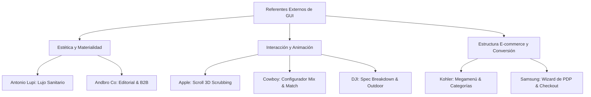

# Referentes Externos de GUI / UI / UX - Benchmark Firplak E-commerce

> [!IMPORTANT]
> **Estrategia Condensada del Segmento**:
> Este compendio reúne los 7 referentes internacionales de UI/UX seleccionados como pilar de diseño para el nuevo ecosistema web de Firplak. Cada referente aporta patrones clave de interacción (scroll storytelling, configuradores 3D, navegaciones e-commerce complejas, estética de lujo y wizards de compra) que guiarán la construcción de la Home, PDPs, Mix & Match y Checkout.

---

## 📌 Índice de Referentes

| Referente | URL Oficial | Módulo Destinado en Firplak | Foco GUI / UX Principal |
| :--- | :--- | :--- | :--- |
| **[Apple AirPods Pro](file:///c:/Users/gabriel.molina/Desktop/ecomerce_firplak/especificaciones/wiki/referentes_externos/apple_airpods_pro.md)** | `https://www.apple.com/airpods-pro/` | `pagina_producto.md`, `hidromasajes.md` | Scroll-driven 3D Scrubbing, Despiece interactivo de producto, Micro-callouts. |
| **[Andbro Co](file:///c:/Users/gabriel.molina/Desktop/ecomerce_firplak/especificaciones/wiki/referentes_externos/andbro_co.md)** | `https://www.andbro.co/works` | `carpinteria_obra.md`, `sistema_diseno.md` | Retícula editorial minimalista, espacios en blanco, portfolio B2B de arquitectura. |
| **[Antonio Lupi](file:///c:/Users/gabriel.molina/Desktop/ecomerce_firplak/especificaciones/wiki/referentes_externos/antonio_lupi.md)** | `https://www.antoniolupi.it/en/home` | `sistema_diseno.md`, `accesorios.md` | Dirección de arte de lujo sanitario italiano, materialidad y texturas de alta gama. |
| **[Kohler](file:///c:/Users/gabriel.molina/Desktop/ecomerce_firplak/especificaciones/wiki/referentes_externos/kohler.md)** | `https://www.kohler.com/en` | `pagina_inicio.md`, `conceptos_catalogo.md` | Arquitectura de Megamenú masivo, navegación B2C/B2B e inspirador por ambiente. |
| **[Cowboy E-Bikes](file:///c:/Users/gabriel.molina/Desktop/ecomerce_firplak/especificaciones/wiki/referentes_externos/cowboy_ebikes.md)** | `https://cowboy.com/` | `mix_and_match.md`, `sistema_diseno.md` | Personalizador 360° en tiempo real, cambio dinámico de acabados y Kinetic Motion UI. |
| **[DJI Mavic 3 Pro](file:///c:/Users/gabriel.molina/Desktop/ecomerce_firplak/especificaciones/wiki/referentes_externos/dji_mavic.md)** | `https://www.dji.com/global/mavic-3-pro` | `hidromasajes.md`, `zona_outdoor.md` | Exposición de ingeniería pesada, fichas técnicas interactivas y visualización de data. |
| **[Samsung Galaxy S25 Ultra](file:///c:/Users/gabriel.molina/Desktop/ecomerce_firplak/especificaciones/wiki/referentes_externos/samsung_galaxy_s25.md)** | `https://www.samsung.com/us/smartphones/galaxy-s25-ultra/buy/` | `pagina_producto.md`, `pagos_e_integraciones.md` | Wizard de compra por pasos, cálculo dinámico de cuotas/financiamiento y add-ons. |

---

## 🎯 Matriz de Aplicación en la Arquitectura de Firplak

---

## 📚 Documentos Detallados

- **[apple_airpods_pro.md](file:///c:/Users/gabriel.molina/Desktop/ecomerce_firplak/especificaciones/wiki/referentes_externos/apple_airpods_pro.md)**: Análisis del scroll cinemático y renderizado por fotogramas.
- **[andbro_co.md](file:///c:/Users/gabriel.molina/Desktop/ecomerce_firplak/especificaciones/wiki/referentes_externos/andbro_co.md)**: Análisis del diseño editorial y retículas para proyectos institucionales.
- **[antonio_lupi.md](file:///c:/Users/gabriel.molina/Desktop/ecomerce_firplak/especificaciones/wiki/referentes_externos/antonio_lupi.md)**: Análisis de la dirección gráfica para baño de alta gama y materiales resinosos/mármol.
- **[kohler.md](file:///c:/Users/gabriel.molina/Desktop/ecomerce_firplak/especificaciones/wiki/referentes_externos/kohler.md)**: Análisis de la jerarquía global de menú, buscador y filtrado e-commerce.
- **[cowboy_ebikes.md](file:///c:/Users/gabriel.molina/Desktop/ecomerce_firplak/especificaciones/wiki/referentes_externos/cowboy_ebikes.md)**: Análisis de interactividad 3D, animación kinetica y personalización en vivo.
- **[dji_mavic.md](file:///c:/Users/gabriel.molina/Desktop/ecomerce_firplak/especificaciones/wiki/referentes_externos/dji_mavic.md)**: Análisis de desglose técnico, acometidas y tablas de alto rendimiento.
- **[samsung_galaxy_s25.md](file:///c:/Users/gabriel.molina/Desktop/ecomerce_firplak/especificaciones/wiki/referentes_externos/samsung_galaxy_s25.md)**: Análisis del wizard transaccional, venta cruzada de accesorios e instalación.
